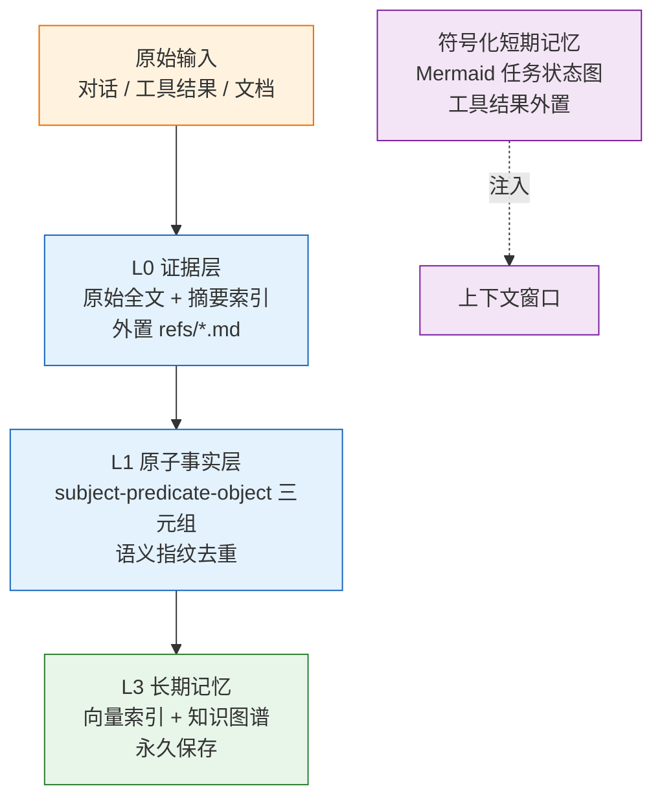
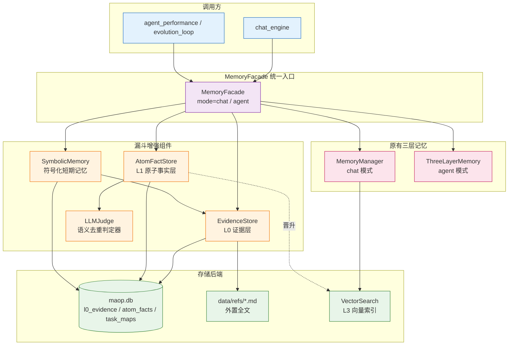
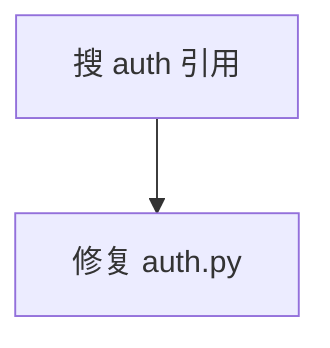
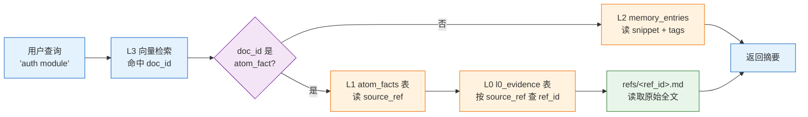
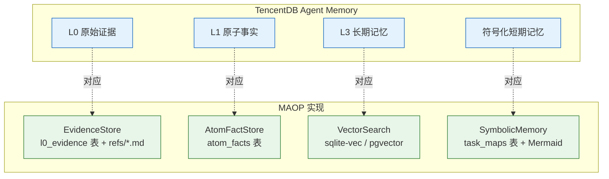
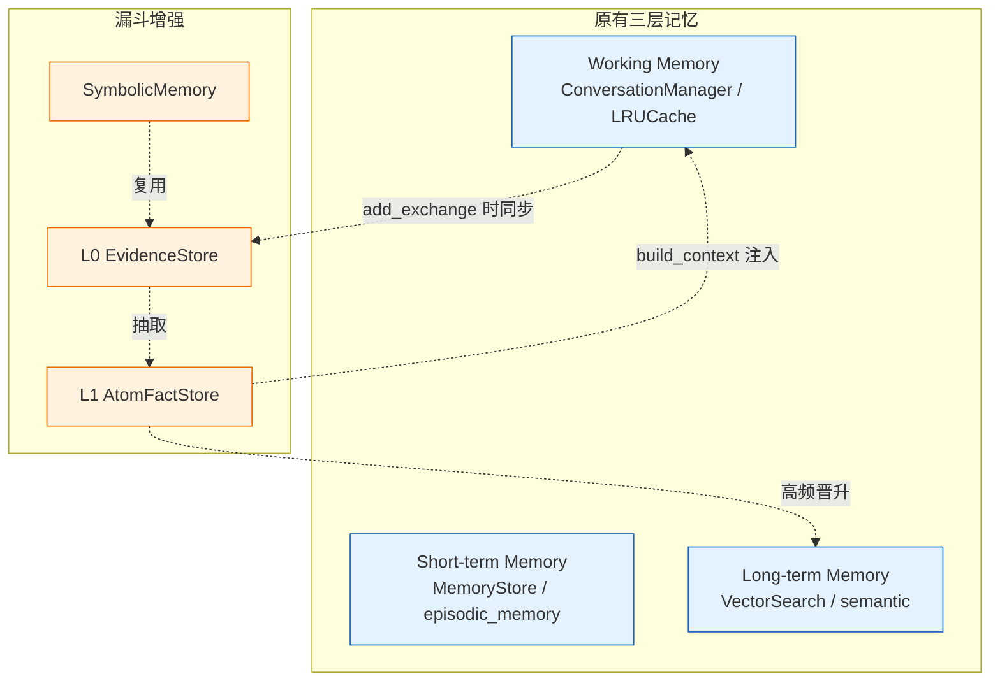

# MAOP 漏斗式记忆架构设计

> 状态：已落地（v4.5.0+）
> 日期：2026-08-24
> 作者：FunnelDocWriter
> 关联模块：`py/maop/memory/{evidence,atoms,symbolic,llm_dedup,manager,facade,shared_db}.py`
> 关联方案：[`funnel-memory-enhancement-plan.md`](./funnel-memory-enhancement-plan.md)

---

## 第1章 概述

### 1.1 设计哲学

MAOP 漏斗式记忆机制对齐 TencentDB Agent Memory 的"漏斗哲学"：**从海量原始证据逐步提炼到少量高价值长期记忆**，每一层都做有损压缩，但保留回查链路，使高层摘要可随时回溯到原始证据。

漏斗的口径由宽到窄，逐层提炼：



图：漏斗式记忆数据流图

### 1.2 核心动机

| 痛点 | 漏斗解决方案 |
|------|--------------|
| 原始证据丢失后无法核验 | L0 保留原始全文（黑匣子），DB 存摘要 + ref 指针 |
| 扁平向量堆无法表达结构关系 | L1 抽取 subject-predicate-object 三元组，保留结构化语义 |
| 同一事实重复入库污染检索 | L1 语义指纹（SHA-256）去重合并 + 可选 LLM 语义去重 |
| 高频事实淹没在低频噪声中 | L1 access_count 计数 + 阈值晋升 L3 长期记忆 |
| 工具结果全文塞爆上下文 | 符号化短期记忆把工具结果外置到 refs，上下文只放摘要 + 引用号 |
| 任务进展日志堆叠膨胀 | 任务状态符号化为 Mermaid 流程图，每轮只注入图 + 证据引用 |

表：漏斗式记忆痛点与解决方案对照表

### 1.3 在 MAOP 三层记忆中的定位

MAOP 原有三层记忆（Working / Short-term / Long-term）由 `MemoryManager` 与 `ThreeLayerMemory` 实现，经 `MemoryFacade` 统一入口。漏斗增强是在原有三层之上叠加的**证据回查与结构化提炼**机制，不替代原有记忆，而是为其提供原始证据保留与结构化知识抽取能力：

- **L0 证据层**：在 `add_exchange` 写入 L2 短期记忆时同步入库，作为对话/工具结果的"黑匣子"
- **L1 原子事实层**：从 L0 原文抽取结构化事实，供 `build_context` 注入到上下文
- **符号化短期记忆**：替代堆叠日志，用 Mermaid 图 + 证据引用号表达任务进展
- **L3 晋升链路**：高频原子事实经 `consolidate()` 触发晋升，写入向量索引成为长期记忆

---

## 第2章 三层架构

### 2.1 架构总览



图：漏斗式记忆三层架构图

### 2.2 L0 Evidence Layer — 原始证据存储

#### 2.2.1 职责

L0 证据层（`py/maop/memory/evidence.py` 中的 `EvidenceStore`）是漏斗的最宽口径，负责**保留原始证据**（对话原文、工具结果、任务图、文档），同时把大体积内容外置到文件，DB 只存摘要 + ref 指针。

设计动机（对齐 TencentDB Agent Memory 漏斗哲学）：

- **原始证据要保留**：压缩/提炼后的记忆若丢失证据，回查链路就断了
- **压缩结果要能回查**：高层记忆（L2/L3）只放摘要，需要细节时按 `ref_id` 回查 L0 原文
- **Token 治理**：工具结果/长对话全文不塞进上下文，只放摘要 + 引用号

#### 2.2.2 Schema

```sql
-- SQL：L0 证据表 Schema
CREATE TABLE IF NOT EXISTS l0_evidence (
    ref_id TEXT PRIMARY KEY,           -- 证据 ID：ev-<timestamp>-<rand6>
    session_id TEXT NOT NULL DEFAULT '',-- 所属会话
    kind TEXT NOT NULL DEFAULT 'conversation', -- 证据种类
    summary TEXT NOT NULL DEFAULT '',  -- 摘要（≤500 字符）
    source TEXT NOT NULL DEFAULT '',   -- 来源标识（工具名/agent 名）
    content_path TEXT NOT NULL DEFAULT '',-- 外置文件路径（空=未外置）
    char_count INTEGER NOT NULL DEFAULT 0, -- 原文字符数
    created_at TEXT NOT NULL,          -- 创建时间（ISO 8601 UTC）
    metadata TEXT DEFAULT '{}'         -- 附加元数据（JSON）
);
CREATE INDEX IF NOT EXISTS idx_l0_session ON l0_evidence(session_id);
CREATE INDEX IF NOT EXISTS idx_l0_kind ON l0_evidence(kind);
CREATE INDEX IF NOT EXISTS idx_l0_created ON l0_evidence(created_at);
```

支持的证据种类（`VALID_KINDS`）：

| kind | 含义 | 典型来源 |
|------|------|----------|
| `conversation` | 对话消息 | user / assistant |
| `tool_result` | 工具执行结果 | grep / ls / cat 等工具 |
| `task_map` | 任务状态图快照 | SymbolicMemory |
| `document` | 外部文档 | 文件读取 / 知识上传 |

表：L0 证据种类说明表

#### 2.2.3 外置策略

超过 `DEFAULT_SPILL_THRESHOLD = 4000` 字节的内容外置到 `<root>/data/refs/<ref_id>.md`，DB 只存摘要；否则全文直接入库。`ref_id` 只允许 `[A-Za-z0-9_-]`（防路径穿越），前缀 `ev-` 便于与其他 ID 区分。

```python
# 代码示例：L0 证据存储与回查（Python）
from maop.memory.evidence import EvidenceStore

ev = EvidenceStore(root_dir="/path/to/MAOP")
# 存储一条工具结果（长文本自动外置到 refs/ev-*.md）
ref = ev.store_evidence(
    session_id="s1",
    kind="tool_result",
    content="<10000 chars of grep output>",
    source="grep",
    metadata={"tool_input": "-r auth"},
)
# 回查完整原文（外置则读文件，未外置则读 summary 列）
full_text = ev.get_evidence(ref)
# 按关键词检索证据摘要
hits = ev.search_evidence("auth", kind="tool_result", top=10)
```

#### 2.2.4 回查链路

L0 提供完整的回查 API：

- `get_evidence(ref_id)` → str：按 ref_id 回查原文（外置读文件，未外置读 summary）
- `get_evidence_meta(ref_id)` → dict：读取元数据（不含原文）
- `search_evidence(query, session_id, kind, top)` → list[dict]：按关键词/会话/种类检索摘要
- `delete_evidence(ref_id)` → bool：删除证据（DB 行 + 外置文件，幂等）
- `prune(older_than_days=90, ...)` → int：清理过期证据，并清理孤儿 refs 文件
- `stats()` → dict：L0 统计（总数、按 kind 分布、外置数、总字符数）

### 2.3 L1 Atom Fact Layer — 原子事实抽取

#### 2.3.1 职责

L1 原子事实层（`py/maop/memory/atoms.py` 中的 `AtomFactStore`）把 L0 原始对话/工具结果提炼为**原子事实**（subject - predicate - object 三元组），并通过**语义指纹**去重合并。

设计动机：

- **结构事实要抽取**：扁平向量堆无法表达"谁和谁是什么关系"，原子事实保留结构化语义，检索更精准
- **去重合并**：避免同一事实重复入库污染检索结果
- **高频晋升**：access_count 达到阈值的事实晋升到 L3 长期记忆

#### 2.3.2 Schema

```sql
-- SQL：L1 原子事实表 Schema
CREATE TABLE IF NOT EXISTS atom_facts (
    id TEXT PRIMARY KEY,              -- 事实 ID：fact-<rand12>
    fingerprint TEXT NOT NULL UNIQUE, -- 语义指纹（SHA-256）
    subject TEXT NOT NULL,            -- 主语
    predicate TEXT NOT NULL DEFAULT '',-- 谓语
    object_value TEXT NOT NULL DEFAULT '',-- 宾语
    source_ref TEXT NOT NULL DEFAULT '',-- 来源证据 ref_id
    topic TEXT NOT NULL DEFAULT 'general',-- 主题
    confidence REAL NOT NULL DEFAULT 0.5,-- 置信度 [0.1, 1.0]
    access_count INTEGER NOT NULL DEFAULT 1,-- 访问计数
    created_at TEXT NOT NULL,         -- 创建时间
    last_seen_at TEXT NOT NULL        -- 最后见到时间
);
CREATE INDEX IF NOT EXISTS idx_atom_subject ON atom_facts(subject);
CREATE INDEX IF NOT EXISTS idx_atom_topic ON atom_facts(topic);
CREATE INDEX IF NOT EXISTS idx_atom_fingerprint ON atom_facts(fingerprint);
CREATE INDEX IF NOT EXISTS idx_atom_last_seen ON atom_facts(last_seen_at);
```

#### 2.3.3 抽取模式

抽取复用 `KnowledgeExtractor` 的模式匹配，不依赖 LLM，零额外成本、确定性可测试：

| 模式类别 | 正则示例 | 抽取结果 |
|----------|----------|----------|
| 关系模式 | `X uses Y` / `X depends on Y` / `X extends Y` / `X calls Y` / `X imports Y` / `X has Y` / `X contains Y` | Relation(source, relation_type, target) |
| 事实模式 | `X is a Y` / `X does Y` / `X returns Y` / `X throws Y` / `X requires Y` | Fact(subject, predicate, object_value) |
| 配置模式 | `key=value` | Fact(key, "=", value) |
| 实体识别 | 文件路径 / 类名（Error/Manager/Service 等后缀）/ 函数名 | Entity |

表：L1 原子事实抽取模式说明表

关系类事实折叠为原子事实：`auth module uses JWT` → `fact(module, uses, JWT)`，初始置信度 0.7（避免噪声污染高频晋升）。

#### 2.3.4 语义指纹去重

`semantic_fingerprint(subject, predicate, object_value)` 计算事实的 SHA-256 指纹。规范化：小写、去空白、去尾标点。相同语义的事实即使措辞略有差异（如 `User likes coffee` vs `the user likes coffee`）也会命中同一指纹。

合并时：

- `access_count` 递增
- `last_seen_at` 更新
- `confidence` 微升（步长 `_CONFIDENCE_STEP = 0.1`，上限 1.0）

#### 2.3.5 LLM 语义去重（方案 A）

SHA-256 指纹只能精确匹配，`user likes coffee` 与 `user prefers coffee` 指纹不同会被存成两条。方案 A 在指纹未命中时，把新事实与同 subject/predicate 的候选交给 LLM 判定"是否同一事实"，命中则合并。

```python
# 代码示例：启用 LLM 语义去重（Python）
from maop.memory.atoms import AtomFactStore
from maop.memory.llm_dedup import build_llm_semantic_judge

judge = build_llm_semantic_judge(root_dir="/path/to/MAOP", model="step-3.7-flash")
atoms = AtomFactStore(root_dir, llm_dedup=True, llm_judge=judge)
# 或通过环境变量 MAOP_LLM_DEDUP=1 启用，判定器自动懒加载
```

判定器契约（`LLMJudge = Callable[[dict, dict], bool | None]`）：

- `True` = 两个事实语义相同（应合并）
- `False` = 语义不同（应插入新）
- `None` = 无法判断（调用方降级为插入新）

设计要点（对齐方案 A 的"低代价 + 失败安全"）：

| 要点 | 说明 |
|------|------|
| 同步调用 | MAOP 的 `LLMProvider` 是 async，而 `atoms.ingest()` 在同步链路，判定器用同步 httpx 直接调 OpenAI 兼容端点 |
| 短超时 | 默认 8s（`DEFAULT_TIMEOUT_S`），LLM 判定不应阻塞记忆写入太久 |
| 失败降级 | 任何异常/解析失败/超时都返回 None，调用方按"插入新"处理——LLM 去重是锦上添花，绝不阻断记忆链路 |
| 默认关闭 | `MAOP_LLM_DEDUP` 未设置时完全不构造判定器，行为与纯指纹去重一致 |
| 候选缩小 | 仅与同 subject 或同 predicate 的候选比较（`_llm_merge_candidates`，top 5），避免全库扫描 |

表：LLM 语义去重设计要点说明表

判定 prompt 要求 LLM 只输出 `{"same": true|false}`，便于解析；`_parse_same` 兜底用正则提取 true/false。

#### 2.3.6 晋升 L3

高频事实（`access_count >= min_access`）可晋升到 L3 长期记忆，通过 `vector_index_fn(doc_id, text, metadata)` 写入向量索引：

```python
# 代码示例：晋升高频事实到 L3（Python）
report = atoms.promote_facts(
    min_access=3,           # access_count >= 3 才晋升
    top=50,                 # 最多晋升 50 条
    vector_index_fn=mgr.long_term_index,  # 写入向量索引
)
# report = {"promoted": 12}
```

晋升后重置 `access_count = 0` 防止重复晋升。晋升文本格式：`{subject} {predicate} {object_value}`，附带 metadata `{"topic", "source_ref", "layer": "atom_fact"}`。

### 2.4 Symbolic Short-term Memory — 符号化短期记忆

#### 2.4.1 职责

符号化短期记忆（`py/maop/memory/symbolic.py` 中的 `SymbolicMemory`）解决单次任务内**上下文爆炸**问题。对齐 TencentDB Agent Memory 的设计哲学——"短期上下文治理和长期记忆同样重要，把工具结果外置、把任务状态符号化，往往比盲目扩大 context window 更有性价比"。

两条链路：

1. **工具结果外置 (offload)**：工具/命令的完整输出不塞进上下文，而是写入 `data/refs/<ref_id>.md`（复用 `EvidenceStore`），上下文里只放一行摘要 + ref 引用号
2. **任务状态图 (task map)**：把任务进展符号化为 Mermaid 流程图（`graph TD`），每轮只注入这张图 + 证据引用，替代堆叠全部日志

#### 2.4.2 Schema

```sql
-- SQL：任务状态图表 Schema
CREATE TABLE IF NOT EXISTS task_maps (
    session_id TEXT NOT NULL,         -- 会话 ID
    node_id TEXT NOT NULL,            -- 节点 ID
    description TEXT NOT NULL DEFAULT '',-- 节点描述
    status TEXT NOT NULL DEFAULT 'todo',-- 状态：todo/active/done/failed
    parent_id TEXT NOT NULL DEFAULT '',-- 父节点（构建分叉/子任务）
    evidence_ref TEXT NOT NULL DEFAULT '',-- 关联证据 ref_id
    metadata TEXT DEFAULT '{}',       -- 附加元数据（JSON）
    created_at TEXT NOT NULL,
    updated_at TEXT NOT NULL,
    PRIMARY KEY (session_id, node_id)
);
CREATE INDEX IF NOT EXISTS idx_taskmap_session ON task_maps(session_id, status);
```

任务状态枚举（`VALID_STATUSES`）：`todo` / `active` / `done` / `failed`。单会话节点上限 `MAX_NODES_PER_MAP = 50`（防图本身膨胀）。

#### 2.4.3 工具结果外置

```python
# 代码示例：工具结果外置与摘要注入（Python）
from maop.memory.symbolic import SymbolicMemory

sym = SymbolicMemory(root_dir="/path/to/MAOP")
result = sym.offload_tool_result(
    tool="grep",
    tool_output="<10000 chars>",
    tool_input="-r auth",
    session_id="s1",
)
# result = {"ref_id": "ev-...", "summary": "grep -r auth → <首行摘要>"}
# 上下文里只放 result["summary"]，需要细节时按 ref_id 回查
```

摘要格式：`{tool} {tool_input[:60]} → {output_first_line[:120]}`，一行式，便于注入。

#### 2.4.4 Mermaid 任务状态图

```python
# 代码示例：任务状态图构建与注入（Python）
sym.update_task_map(session_id="s1", step_id="n1", description="搜 auth 引用",
                    status="active", evidence_ref="ev-xxx")
sym.update_task_map(session_id="s1", step_id="n2", description="修复 auth.py",
                    status="todo", parent_id="n1")
sym.mark_done(session_id="s1", step_id="n1")
mermaid = sym.get_task_map(session_id="s1")
# mermaid 内容如下：
```

```mermaid
graph TD
  n1["搜 auth 引用"]:::done<br/><font size='1'>ref:ev-xxx</font>
  n1 --> n2["修复 auth.py"]
```

图：任务状态图示例

`_safe_label` 清洗 Mermaid 标签：去引号 + 截断（80 字符）+ 过滤语法字符（`-->` / `class` / `subgraph` / `graph` 等关键字用 Unicode 连字符替代 ASCII 连字符），防 Mermaid 语法注入。`_safe_node_id` 节点 ID 只允许字母数字下划线。

#### 2.4.5 上下文注入

`build_injection(session_id)` 构建符号化短期记忆注入块（只放图 + 证据引用，不放全文）：

```text
[Task Map]


[Evidence Refs]
- `ev-aaa`: grep -r auth → auth.py:42 uses JWT
- `ev-bbb`: cat auth.py → class AuthHandler(BaseHandler)
```

注入顺序（漏斗由窄到宽，先高层后细节）：

1. 符号化任务状态图（最浓缩）
2. 长期记忆（L3）
3. 原子事实（L1，结构化知识）
4. 近期记忆（L2）

---

## 第3章 回查链路

### 3.1 完整回查路径

漏斗式记忆的核心承诺是**从 L3 长期记忆回查到 L0 原始证据**的完整路径不断裂。回查链路如下：



图：L3 到 L0 回查链路流程图

### 3.2 回查入口

| 入口 | 方法 | 说明 |
|------|------|------|
| L3 向量命中 → L1 | `atom_facts.get_fact(fact_id)` | 按 fact_id 读取单条事实，含 `source_ref` 字段 |
| L1 事实 → L0 证据 | `evidence_store.get_evidence(ref_id)` | 按 source_ref 回查 L0 原文 |
| L0 摘要检索 | `evidence_store.search_evidence(query)` | 按关键词检索证据摘要，命中后可回查原文 |
| L1 事实检索 | `atom_facts.search_facts(query)` | 按关键词检索原子事实，命中递增 access_count |
| 符号化图 → 证据 | `symbolic.get_task_map_nodes(session_id)` | 读取节点明细，每节点含 `evidence_ref` |

表：回查链路入口说明表

### 3.3 回查示例

```python
# 代码示例：完整回查链路（Python）
from maop.memory.facade import MemoryFacade

facade = MemoryFacade(root_dir="/path/to/MAOP", mode="chat")

# 1. L3 向量检索：用户问 "auth module 用什么"
lt_results = facade.long_term_search("auth module", top=5)
# 假设命中一条 doc_id="fact-abc123"

# 2. L1 读取事实详情，拿到 source_ref
atoms = facade.atom_facts()
fact = atoms.get_fact("fact-abc123")
# fact = {"subject": "auth module", "predicate": "uses", "object_value": "JWT",
#         "source_ref": "ev-20260824-001234-abc", ...}

# 3. L0 回查原始证据
ev = facade.evidence_store()
original_text = ev.get_evidence(fact["source_ref"])
# original_text = "<原始对话或工具结果全文>"
```

### 3.4 注入时的回查

`MemoryManager.build_context(session_id, query)` 在构建上下文时自动执行漏斗回查：

1. L1 工作记忆（对话窗口）
2. L2 短期记忆检索（`MemoryStore.search`）
3. L3 长期记忆检索（`MemoryStore.search` + `dream-consolidated` tag 过滤）
4. **漏斗增强**：L1 原子事实检索（`atom_facts.search_facts`）+ 符号化任务图（`symbolic.get_task_map`）+ 证据引用（`symbolic.evidence.search_evidence`）
5. 合并为 `MemoryContext`，含 `atom_facts` / `evidence_refs` / `symbolic_map` 字段

---

## 第4章 配置开关

### 4.1 环境变量总览

| 环境变量 | 默认值 | 说明 | 影响模块 |
|----------|--------|------|----------|
| `MAOP_LLM_DEDUP` | 未设置（False） | LLM 语义去重开关。`1`/`true`/`yes`/`on` 视为真 | `atoms.py` / `manager.py` |
| `MAOP_DB_PER_MODULE` | `0` | DB 模式。`0`=unified（所有模块共享 `maop.db`），`1`=per-module（各模块独立 `.db`） | `db_utils.py` / `shared_db.py` |
| `MAOP_DATA_DIR` | `<root>/data` | 数据目录路径（DB 文件 + refs 文件存放位置） | `db_utils.py` |
| `MAOP_MEMORY_DB_PATH` | 空 | 记忆 DB 自定义路径（覆盖默认） | `shared_db.py` |
| `MAOP_MEMORY_PRUNE_TTL_DAYS` | `90` | 短期记忆保留期（天） | `MemoryStore.prune` |
| `MAOP_MEMORY_PRUNE_ON_STARTUP` | `0` | 启动时自动清理过期记忆 | `MemoryStore` |
| `MAOP_CLEANUP_OLD_DB` | `0` | 迁移旧 `episodic.db` 后是否自动删除旧文件 | `shared_db.py` |
| `MAOP_SQLITE_BUSY_TIMEOUT_MS` | `10000` | SQLite busy timeout（毫秒） | `db_utils.py` |
| `MAOP_DB_BACKEND` | `sqlite` | DB 后端。`sqlite` / `postgresql` | `db_utils.py` |
| `MAOP_DATABASE_URL` | 空 | 数据库连接 URL（覆盖默认） | `db_utils.py` |

表：漏斗式记忆相关环境变量说明表

### 4.2 DB 路径解析

`get_memory_db_path()` 返回记忆 DB 路径，由 `get_db_path("memory")` 实现：

- **unified 模式**（默认，`MAOP_DB_PER_MODULE=0`）：返回 `<data_dir>/maop.db`，与 `MemoryStore` / `MemoryManager` / `ThreeLayerMemory` 共享同一个 SQLite 文件
- **per-module 模式**（`MAOP_DB_PER_MODULE=1`）：返回 `<data_dir>/memory.db`，记忆模块独立 DB

漏斗增强的三张表（`l0_evidence` / `atom_facts` / `task_maps`）与原有表（`memory_entries` / `episodic_memory` / `consolidation_log`）schema 不同但表名不冲突，可安全共存于同一 DB。

### 4.3 LLM 语义去重配置

`MAOP_LLM_DEDUP=1` 启用后，`AtomFactStore` 在指纹未命中时调用 LLM 判定器。判定器从 `config/models.yaml` 读取配置：

```yaml
# config/models.yaml 示例
providers:
  step:
    base_url: https://api.stepfun.com/v1
    api_key_env: STEP_API_KEY
models:
  step-3.7-flash:
    provider: step
    model_id: step-3.7-flash
    enabled: true
```

配置加载兼容两种形态：

- **新形态**：`models: {name: {provider, model_id, ...}}` + `providers: {...}`
- **直连形态**：模型条目直接带 `base_url` / `api_key_env`

API key 优先从环境变量读取（`api_key_env` 指定的变量名），其次从配置文件的 `api_key` 字段读取。

### 4.4 MemoryManagerConfig

```python
# 代码示例：MemoryManager 配置（Python）
from maop.memory.manager import MemoryManagerConfig, ConsolidationTrigger

config = MemoryManagerConfig(
    max_working_tokens=4000,          # L1 工作记忆窗口
    short_term_ttl_days=30,           # L2 短期记忆保留期
    long_term_min_group_size=3,       # L3 晋升最小 access_count
    consolidation=ConsolidationTrigger(
        entry_threshold=100,          # 触发 consolidation 的条目数
        days_since_last=7,            # 距上次 consolidation 的天数
        auto_trigger=True,            # 自动触发
    ),
    inject_max_results=5,             # 注入最大结果数
    inject_max_tokens=800,            # 注入最大 token 数
    llm_dedup=True,                   # LLM 语义去重（默认读 MAOP_LLM_DEDUP）
)
```

---

## 第5章 API 端点

### 5.1 端点总览

漏斗记忆 API 端点统一挂在 `/api/memory/funnel/*` 路径下，复用 `routers/memory.py` 现有 router，避免新增文件碎片化。所有端点使用 `require_admin` 权限，与现有 `memory.py` 端点一致。

| # | 端点 | 方法 | 功能 | 请求参数 | 返回 |
|---|------|------|------|----------|------|
| 1 | `/api/memory/funnel/stats` | GET | L0+L1+符号化三层统计 | 无 | `{l0: {...}, l1: {...}, symbolic: {...}}` |
| 2 | `/api/memory/funnel/evidence` | GET | L0 证据列表（分页+搜索+kind 过滤） | `page`, `page_size`, `query`, `kind`, `session_id` | `{items, total, page, page_size}` |
| 3 | `/api/memory/funnel/evidence/{ref_id}` | GET | L0 证据原文回查 | `ref_id` (path) | `{ref_id, content, meta}` |
| 4 | `/api/memory/funnel/evidence/{ref_id}` | DELETE | 删除单条证据 | `ref_id` (path) | `{deleted: bool}` |
| 5 | `/api/memory/funnel/evidence/prune` | POST | 批量清理过期证据 | `{older_than_days, kind, limit}` | `{pruned: int}` |
| 6 | `/api/memory/funnel/facts` | GET | L1 原子事实列表（分页+搜索+topic 过滤） | `page`, `page_size`, `query`, `topic`, `min_access` | `{items, total, page, page_size}` |
| 7 | `/api/memory/funnel/facts/{fact_id}` | GET | 单条事实详情 | `fact_id` (path) | `{fact}` |
| 8 | `/api/memory/funnel/facts/promote` | POST | 晋升高频事实到 L3 | `{min_access, top}` | `{promoted: int}` |
| 9 | `/api/memory/funnel/task-map/{session_id}` | GET | Mermaid 任务状态图 | `session_id` (path) | `{mermaid: str}` |
| 10 | `/api/memory/funnel/task-map/{session_id}/nodes` | GET | 任务图节点明细 | `session_id` (path) | `{nodes: list}` |
| 11 | `/api/memory/funnel/task-map/{session_id}` | DELETE | 清空会话任务图 | `session_id` (path) | `{cleared: int}` |

表：漏斗记忆 API 端点说明表

### 5.2 实现要点

- 通过 `MemoryFacade` 的透传 API（`evidence_store()` / `atom_facts()` / `symbolic()`）访问底层组件
- 使用 `handle_api_errors` 装饰器统一错误处理
- 分页参数：`?page=1&page_size=20`，返回 `{items, total, page, page_size}`
- agent 模式下 facade 返回 None/空，API 返回空列表而非 404

### 5.3 端点示例

```bash
# 命令示例：漏斗记忆 API 调用
# 1. 查看三层统计
curl -X GET http://localhost:9079/api/memory/funnel/stats -H "Authorization: Bearer <token>"

# 2. 检索 L0 证据（分页 + kind 过滤）
curl -X GET "http://localhost:9079/api/memory/funnel/evidence?page=1&page_size=20&kind=tool_result&query=auth" \
  -H "Authorization: Bearer <token>"

# 3. 回查证据原文
curl -X GET http://localhost:9079/api/memory/funnel/evidence/ev-20260824-001234-abc \
  -H "Authorization: Bearer <token>"

# 4. 清理 90 天前的证据
curl -X POST http://localhost:9079/api/memory/funnel/evidence/prune \
  -H "Authorization: Bearer <token>" \
  -H "Content-Type: application/json" \
  -d '{"older_than_days": 90}'

# 5. 晋升高频事实到 L3
curl -X POST http://localhost:9079/api/memory/funnel/facts/promote \
  -H "Authorization: Bearer <token>" \
  -H "Content-Type: application/json" \
  -d '{"min_access": 3, "top": 50}'

# 6. 获取会话任务状态图（Mermaid）
curl -X GET http://localhost:9079/api/memory/funnel/task-map/sess-001 \
  -H "Authorization: Bearer <token>"
```

---

## 第6章 性能考量

### 6.1 FTS5 全文检索

#### 6.1.1 现状

`AtomFactStore.search_facts` 当前用 `LIKE %query%` 全表扫描 `atom_facts` 表，无法利用索引。在事实条目数增长到万级以上时检索延迟显著。

#### 6.1.2 FTS5 优化方案

为 `atom_facts` 表添加 FTS5 虚拟表（需 SQLite 编译启用 FTS5 扩展，大多数发行版默认支持）：

```sql
-- SQL：FTS5 虚拟表创建
CREATE VIRTUAL TABLE IF NOT EXISTS atom_facts_fts USING fts5(
    subject, predicate, object_value, topic,
    content='atom_facts', content_rowid='rowid'
);
-- 通过触发器同步（或应用层写入时同步）
```

`search_facts` 改用 FTS5 MATCH：

```sql
-- SQL：FTS5 检索
SELECT a.* FROM atom_facts a
JOIN atom_facts_fts f ON a.rowid = f.rowid
WHERE atom_facts_fts MATCH ?
ORDER BY rank LIMIT ?
```

#### 6.1.3 命中计数优化

`search_facts` 命中后递增 `access_count` 已优化为**只对返回的 top N 条目**批量更新，避免单字符 query 命中大量行导致全表 `access_count + 1`：

```python
# 代码示例：命中计数批量更新（Python）
if query and results:
    ids = [r["id"] for r in results]
    placeholders = ",".join("?" for _ in ids)
    conn.execute(
        f"UPDATE atom_facts SET access_count = access_count + 1 "
        f"WHERE id IN ({placeholders})",
        ids,
    )
```

### 6.2 向量索引

L3 长期记忆使用 `VectorSearch`（基于 sqlite-vec，企业版可切 pgvector）。原子事实晋升时通过 `long_term_index(doc_id, text, metadata)` 写入向量索引：

- **Personal 版**：sqlite-vec（默认依赖，HNSW 补充）
- **Enterprise 版**：pgvector（IVFFLAT + HNSW 双索引策略）

索引策略配置详见 [HLD 三阶段路线图 §2.2](./hld-three-phase-roadmap.md)。

### 6.3 prune 策略

#### 6.3.1 L0 证据自动清理

`MemoryManager.consolidate()` 末尾自动触发 L0 清理（与 consolidation 同周期），避免 refs 文件持续膨胀：

```python
# 代码示例：consolidate 末尾自动清理 L0（Python）
if self.evidence_store is not None:
    try:
        pruned = self.evidence_store.prune(older_than_days=90)
        if pruned:
            logger.info("[memory_manager] L0 prune: %d 条过期证据已清理", pruned)
    except Exception as exc:
        logger.warning("[memory_manager] L0 prune failed: %s", exc)
```

prune 失败不影响 consolidation 主流程。清理后自动调用 `_cleanup_orphan_files()` 清理 refs/ 目录中不在 DB 里的孤儿 `.md` 文件。

#### 6.3.2 L1 事实保留

L1 原子事实目前无自动清理（事实是结构化知识，价值密度高）。高频事实晋升 L3 后 `access_count` 重置为 0，避免重复晋升。如需清理低频事实，可按 `last_seen_at` 手动清理。

#### 6.3.3 符号化任务图清理

`SymbolicMemory.clear_session(session_id)` 在会话结束/重置时清空任务图。单会话节点上限 `MAX_NODES_PER_MAP = 50`，防图本身膨胀。

### 6.4 性能指标

| 操作 | 复杂度 | 说明 |
|------|--------|------|
| L0 存储 | O(1) | SQLite INSERT + 可选文件写入 |
| L0 回查 | O(1) | 按 PRIMARY KEY 查 + 可选文件读 |
| L0 检索 | O(N) | LIKE 全表扫描，N = 证据条数 |
| L1 抽取 | O(M × P) | M = 文本长度，P = 模式数（固定 ~15） |
| L1 去重 | O(1) | SHA-256 指纹 + DB UNIQUE 索引 |
| L1 LLM 去重 | O(K × T) | K = 候选数（≤5），T = LLM 延迟（≤8s） |
| L1 检索 | O(N) | LIKE 全表扫描（FTS5 优化后 O(log N)） |
| L1 晋升 | O(top) | 按 access_count 排序取 top N |
| 符号化图生成 | O(N) | N = 节点数（≤50） |

表：漏斗式记忆操作复杂度说明表

### 6.5 限制与风险

| 限制 | 影响 | 缓解措施 |
|------|------|----------|
| FTS5 可用性 | 需确认 SQLite 编译了 FTS5 扩展 | 不可用时保留 LIKE 查询（P3-A 可选优化） |
| LLM 去重延迟 | 单次判定最多 8s | 默认关闭，启用后候选缩小到 ≤5 条 |
| refs 文件膨胀 | 外置文件持续增长 | consolidate 末尾自动 prune + 孤儿文件清理 |
| 任务图节点上限 | 单会话 ≤ 50 节点 | 超限拒绝新增并告警 |
| Mermaid 注入风险 | description 含语法字符 | `_safe_label` 过滤关键字 + 截断 80 字符 |
| agent 模式 DB 隔离 | agent 模式独立漏斗组件实例 | 共用 `maop.db`，DB 路径一致 |

表：漏斗式记忆限制与缓解措施说明表

---

## 第7章 与 TencentDB Agent Memory 的对齐关系

### 7.1 设计哲学对齐

TencentDB Agent Memory 提出"漏斗哲学"：**短期上下文治理和长期记忆同样重要，把工具结果外置、把任务状态符号化，往往比盲目扩大 context window 更有性价比**。MAOP 漏斗式记忆机制完整对齐这一哲学：

| TencentDB Agent Memory 原则 | MAOP 实现 | 源文件 |
|------------------------------|-----------|--------|
| 原始证据要保留 | L0 EvidenceStore 保留原始全文（黑匣子） | `evidence.py` |
| 压缩结果要能回查 | L0 提供 `get_evidence(ref_id)` 回查原文 | `evidence.py` |
| Token 治理 | 工具结果外置到 refs，上下文只放摘要 + 引用号 | `symbolic.py` |
| 结构事实要抽取 | L1 AtomFactStore 抽取 subject-predicate-object 三元组 | `atoms.py` |
| 去重合并 | L1 语义指纹（SHA-256）+ 可选 LLM 语义去重 | `atoms.py` / `llm_dedup.py` |
| 高频晋升 | L1 access_count 计数 + 阈值晋升 L3 向量索引 | `atoms.py` / `manager.py` |
| 任务状态符号化 | Mermaid 任务状态图替代堆叠日志 | `symbolic.py` |

表：MAOP 与 TencentDB Agent Memory 哲学对齐对照表

### 7.2 漏斗层级对齐



图：MAOP 与 TencentDB Agent Memory 层级对齐示意图

### 7.3 差异与扩展

MAOP 在对齐 TencentDB Agent Memory 的基础上做了以下扩展：

| 扩展点 | MAOP 实现 | 设计动机 |
|--------|-----------|----------|
| LLM 语义去重（方案 A） | `llm_dedup.py` 同步 httpx 判定器 | SHA-256 指纹只能精确匹配，LLM 可判定语义相同 |
| 双模式支持 | `MemoryFacade` chat / agent 模式均可用 | chat 模式透传 MemoryManager，agent 模式懒加载独立实例 |
| 共享 DB | `shared_db.py` 统一 DB 路径 | L0/L1/L2/L3 共享 `maop.db`，跨实现通信 |
| 自动 prune | `consolidate()` 末尾触发 L0 清理 | 避免 refs 文件持续膨胀 |
| Mermaid 注入防护 | `_safe_label` 过滤语法字符 | 防 description 含 `-->` / `class` 等关键字破坏图结构 |
| 候选缩小 | LLM 去重仅与同 subject/predicate 候选比较 | 避免全库扫描，控制 LLM 调用次数 |

表：MAOP 对 TencentDB Agent Memory 的扩展说明表

### 7.4 与原有三层记忆的关系

漏斗增强不替代 MAOP 原有三层记忆（Working / Short-term / Long-term），而是为其叠加证据回查与结构化提炼能力：



图：漏斗增强与原有三层记忆关系图

| 原有三层 | 漏斗增强交互 |
|----------|--------------|
| Working Memory | `build_context` 时注入 L1 原子事实 + 符号化任务图 |
| Short-term Memory | `add_exchange` 时同步写入 L0 证据 |
| Long-term Memory | L1 高频事实晋升写入 L3 向量索引 |

表：原有三层与漏斗增强交互说明表

### 7.5 源文件索引

| 模块 | 源文件 | 职责 |
|------|--------|------|
| L0 证据层 | `py/maop/memory/evidence.py` | 原始证据存储 + refs 外置 + 回查链路 |
| L1 原子事实层 | `py/maop/memory/atoms.py` | 原子事实抽取 + 语义指纹去重 + 晋升 L3 |
| 符号化短期记忆 | `py/maop/memory/symbolic.py` | 工具结果外置 + Mermaid 任务状态图 |
| LLM 语义去重 | `py/maop/memory/llm_dedup.py` | LLM 判定器（方案 A） |
| MemoryManager 集成 | `py/maop/memory/manager.py` | 漏斗增强懒加载组件 + consolidate 触发 prune + 晋升链路 |
| MemoryFacade 透传 | `py/maop/memory/facade.py` | chat / agent 双模式透传漏斗增强 API |
| 共享 DB | `py/maop/memory/shared_db.py` | 统一 DB 路径 + 术语映射 + 旧数据迁移 |
| 知识抽取器 | `py/maop/core/memory/knowledge_extractor.py` | 模式匹配抽取事实与关系（L1 复用） |
| 向量检索 | `py/maop/memory/vector_search.py` | L3 向量索引（sqlite-vec / pgvector） |
| API 端点 | `py/maop/dashboard/routers/memory.py` | `/api/memory/funnel/*` 11 个端点 |
| 前端面板 | `dashboard-enterprise/src/views/FunnelMemory.vue` | 漏斗记忆可视化面板 |

表：漏斗式记忆源文件索引表

---

## 附录 A：术语表

| 术语 | 含义 |
|------|------|
| 漏斗式记忆 | 从海量原始证据逐步提炼到少量高价值长期记忆的机制 |
| L0 证据层 | 保留原始全文的"黑匣子"，DB 存摘要 + ref 指针 |
| L1 原子事实层 | subject-predicate-object 三元组，语义指纹去重 |
| L3 长期记忆 | 向量索引 + 知识图谱，永久保存 |
| 符号化短期记忆 | Mermaid 任务状态图 + 工具结果外置 |
| ref_id | 证据引用 ID，格式 `ev-<timestamp>-<rand6>` |
| 语义指纹 | SHA-256(subject\|predicate\|object_value)，规范化后计算 |
| LLM 语义去重 | 方案 A：指纹未命中时用 LLM 判定语义相同性 |
| 晋升 | L1 高频事实（access_count >= 阈值）写入 L3 向量索引 |
| 回查链路 | 从 L3 长期记忆回查到 L0 原始证据的完整路径 |
| 外置 | 大体积内容写入 refs/*.md 文件，DB 只存指针 |
| 孤儿文件 | refs/ 目录中不在 DB 里的 .md 文件（DB 已删但文件未清理） |

表：漏斗式记忆术语表

## 附录 B：变更历史

| 版本 | 日期 | 变更 |
|------|------|------|
| v4.5.0 | 2026-08-24 | 初始架构文档，对齐 TencentDB Agent Memory 漏斗哲学 |

表：文档变更历史表