# MAOP 三阶段演进路线图 — 高层设计文档（HLD）

## 文档信息

| 字段 | 值 |
|------|-----|
| 文档名称 | MAOP 三阶段演进路线图 HLD |
| 版本 | v1.0.0-draft |
| 发布日期 | 2026-08-07 |
| 作者 | MAOP 高级技术文档专家 |
| 状态 | Draft - Pending Review |
| 适用范围 | MAOP Personal Edition + Enterprise Edition |
| 评审人 | TBD（待指定架构委员会 + SRE + 安全） |
| 关联文档 | [prd-three-phase-roadmap.md](./prd-three-phase-roadmap.md)、[ROADMAP.md](../ROADMAP.md)、[platform-evolution.md](./platform-evolution.md) |
| 文档约定 | Markdown heading：H1 文档名 / H2 章 / H3 节 / H4 子节 / H5 子子节；架构图使用 Mermaid 语法（GitHub/VSCode 兼容） |

---

## 第1章 系统架构概览

### 1.1 当前架构（v5.0.0 基线）

MAOP 当前为单进程五层架构，数据层以 SQLite + JSON + YAML 为主，向量检索基于 sqlite-vec/HNSW，记忆系统存在 legacy 与 UnifiedMemoryProtocol 双套并存。

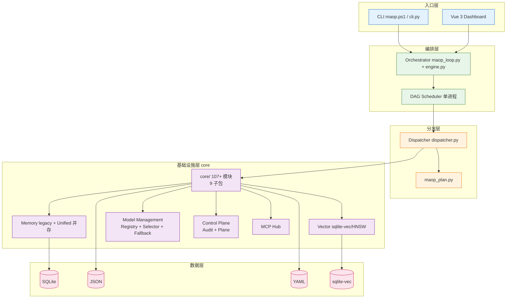
```mermaid
graph TB
    subgraph 入口层
        CLI[CLI maop.ps1 / cli.py]
        DASH[Vue 3 Dashboard]
    end
    subgraph 编排层
        ORCH[Orchestrator maop_loop.py + engine.py]
        DAG[DAG Scheduler 单进程]
    end
    subgraph 分发层
        DISP[Dispatcher dispatcher.py]
        PLAN[maop_plan.py]
    end
    subgraph 基础设施层 core
        CORE[core/ 107+ 模块<br/>9 子包]
        MEM[Memory legacy + Unified 并存]
        VEC[Vector sqlite-vec/HNSW]
        MODEL[Model Management<br/>Registry + Selector + Fallback]
        CTRL[Control Plane<br/>Audit + Plane]
        MCP[MCP Hub]
    end
    subgraph 数据层
        SQLITE[(SQLite)]
        JSON[(JSON)]
        YAML[(YAML)]
        VECDB[(sqlite-vec)]
    end

    CLI --> ORCH
    DASH --> ORCH
    ORCH --> DAG
    DAG --> DISP
    DISP --> PLAN
    DISP --> CORE
    CORE --> MEM
    CORE --> VEC
    CORE --> MODEL
    CORE --> CTRL
    CORE --> MCP
    MEM --> SQLITE
    VEC --> VECDB
    CORE --> JSON
    CORE --> YAML

    classDef entry fill:#e3f2fd,stroke:#1565c0
    classDef orch fill:#e8f5e9,stroke:#2e7d32
    classDef disp fill:#fff3e0,stroke:#ef6c00
    classDef core fill:#f3e5f5,stroke:#7b1fa2
    classDef data fill:#fce4ec,stroke:#c2185b
    class CLI,DASH entry
    class ORCH,DAG orch
    class DISP,PLAN disp
    class CORE,MEM,VEC,MODEL,CTRL,MCP core
    class SQLITE,JSON,YAML,VECDB data
```

### 1.2 演进后目标架构（v8.0.0 终态）

经三阶段演进，MAOP 成为分布式、多模态、自演化、多租户、联邦化的智能体优化平台生态。

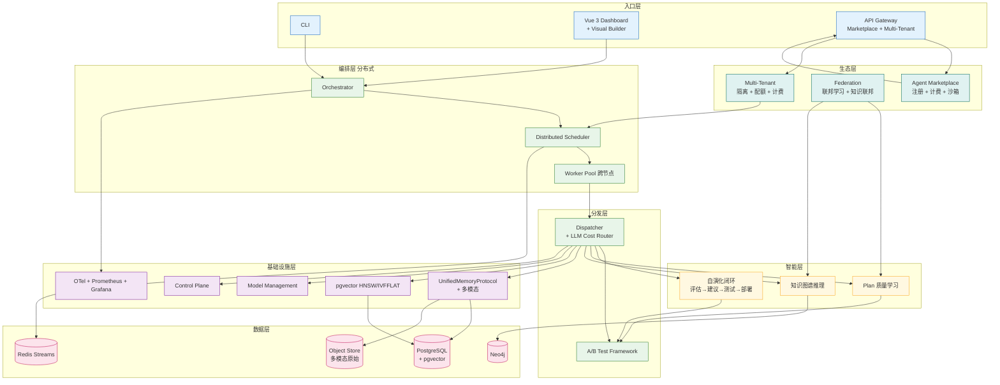
```mermaid
graph TB
    subgraph 入口层
        CLI[CLI]
        DASH[Vue 3 Dashboard<br/>+ Visual Builder]
        GW[API Gateway<br/>Marketplace + Multi-Tenant]
    end
    subgraph 编排层 分布式
        ORCH[Orchestrator]
        DSCHED[Distributed Scheduler]
        WPOOL[Worker Pool 跨节点]
    end
    subgraph 分发层
        DISP[Dispatcher<br/>+ LLM Cost Router]
        ABTEST[A/B Test Framework]
    end
    subgraph 智能层
        EVO[自演化闭环<br/>评估→建议→测试→部署]
        PLANQ[Plan 质量学习]
        KG[知识图谱推理]
    end
    subgraph 基础设施层
        MEM[UnifiedMemoryProtocol<br/>+ 多模态]
        VEC[pgvector HNSW/IVFFLAT]
        MODEL[Model Management]
        CTRL[Control Plane]
        OTEL[OTel + Prometheus + Grafana]
    end
    subgraph 生态层
        MKT[Agent Marketplace<br/>注册 + 计费 + 沙箱]
        FED[Federation<br/>联邦学习 + 知识联邦]
        TENANT[Multi-Tenant<br/>隔离 + 配额 + 计费]
    end
    subgraph 数据层
        PG[(PostgreSQL<br/>+ pgvector)]
        NEO[(Neo4j)]
        REDIS[(Redis Streams)]
        OBJ[(Object Store<br/>多模态原始)]
    end

    CLI --> ORCH
    DASH --> ORCH
    GW --> MKT
    GW --> TENANT
    ORCH --> DSCHED
    DSCHED --> WPOOL
    WPOOL --> DISP
    DISP --> ABTEST
    DISP --> EVO
    DISP --> PLANQ
    DISP --> KG
    EVO --> ABTEST
    PLANQ --> ABTEST
    DISP --> MEM
    DISP --> VEC
    DISP --> MODEL
    DISP --> CTRL
    ORCH --> OTEL
    MKT --> GW
    FED --> PLANQ
    FED --> KG
    TENANT --> DSCHED
    MEM --> PG
    MEM --> OBJ
    VEC --> PG
    KG --> NEO
    DSCHED --> REDIS

    classDef entry fill:#e3f2fd,stroke:#1565c0
    classDef orch fill:#e8f5e9,stroke:#2e7d32
    classDef smart fill:#fff8e1,stroke:#f9a825
    classDef core fill:#f3e5f5,stroke:#7b1fa2
    classDef eco fill:#e0f2f1,stroke:#00695c
    classDef data fill:#fce4ec,stroke:#c2185b
    class CLI,DASH,GW entry
    class ORCH,DSCHED,WPOOL,DISP,ABTEST orch
    class EVO,PLANQ,KG smart
    class MEM,VEC,MODEL,CTRL,OTEL core
    class MKT,FED,TENANT eco
    class PG,NEO,REDIS,OBJ data
```

### 1.3 架构演进原则

1. **兼容优先**：每个阶段保持 API 向后兼容，数据迁移提供回滚。
2. **抽象先行**：引入新后端前先定义抽象接口（如 `VectorBackend`、`MemoryFacade`），新旧后端可切换。
3. **渐进迁移**：灰度切换 + 双写并行 + 校验 + 切流量。
4. **可观测性内置**：所有新组件默认接入 OTel，不依赖事后补丁。
5. **双版一致**：Personal 与 Enterprise 共享核心，差异通过 FeatureFlag gate，不 fork 代码。

---

## 第2章 阶段一架构设计

### 2.1 分布式执行架构

#### 2.1.1 架构图

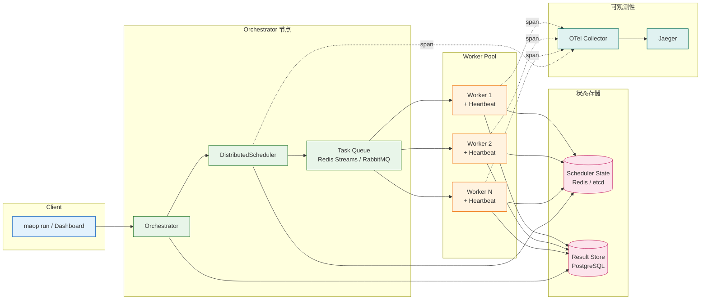
```mermaid
graph LR
    subgraph Client
        CLI[maop run / Dashboard]
    end
    subgraph Orchestrator 节点
        ORCH[Orchestrator]
        DSCHED[DistributedScheduler]
        TQ[Task Queue<br/>Redis Streams / RabbitMQ]
    end
    subgraph Worker Pool
        W1[Worker 1<br/>+ Heartbeat]
        W2[Worker 2<br/>+ Heartbeat]
        W3[Worker N<br/>+ Heartbeat]
    end
    subgraph 状态存储
        SCHEDDB[(Scheduler State<br/>Redis / etcd)]
        RESULTDB[(Result Store<br/>PostgreSQL)]
    end
    subgraph 可观测性
        OTEL[OTel Collector]
        JAEGER[Jaeger]
    end

    CLI --> ORCH
    ORCH --> DSCHED
    DSCHED --> TQ
    TQ --> W1
    TQ --> W2
    TQ --> W3
    W1 --> SCHEDDB
    W2 --> SCHEDDB
    W3 --> SCHEDDB
    W1 --> RESULTDB
    W2 --> RESULTDB
    W3 --> RESULTDB
    DSCHED --> SCHEDDB
    ORCH --> RESULTDB
    W1 -.span.-> OTEL
    W2 -.span.-> OTEL
    W3 -.span.-> OTEL
    DSCHED -.span.-> OTEL
    OTEL --> JAEGER

    classDef client fill:#e3f2fd,stroke:#1565c0
    classDef orch fill:#e8f5e9,stroke:#2e7d32
    classDef worker fill:#fff3e0,stroke:#ef6c00
    classDef store fill:#fce4ec,stroke:#c2185b
    classDef obs fill:#e0f2f1,stroke:#00695c
    class CLI client
    class ORCH,DSCHED,TQ orch
    class W1,W2,W3 worker
    class SCHEDDB,RESULTDB store
    class OTEL,JAEGER obs
```

#### 2.1.2 核心组件

| 组件 | 职责 | 关键接口 |
|------|------|----------|
| `DistributedScheduler` | 替代 `LocalScheduler`，任务分发 + worker 管理 + 重调度 | `submit(dag) → job_id`、`status(job_id) → JobStatus` |
| `Worker` | 注册 + 心跳 + 拉取任务 + 执行 + 上报 | `register()`、`heartbeat()`、`execute(task) → result` |
| `TaskQueue` | 任务缓冲 + 分发 + ACK | 基于 Redis Streams（XADD/XREAD/XACK）或 RabbitMQ |
| `SchedulerState` | worker 注册表 + 任务状态机 + 心跳监控 | Redis Hash / etcd KV |
| `ResultAggregator` | 分布式结果回写到 Orchestrator | 写 PostgreSQL，通知 Orchestrator |

#### 2.1.3 任务状态机

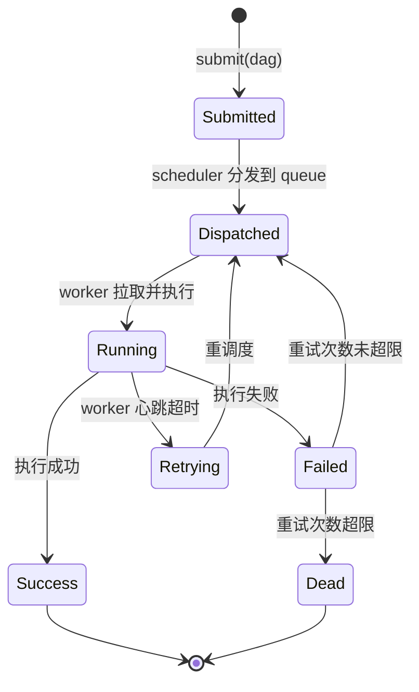
```mermaid
stateDiagram-v2
    [*] --> Submitted: submit(dag)
    Submitted --> Dispatched: scheduler 分发到 queue
    Dispatched --> Running: worker 拉取并执行
    Running --> Success: 执行成功
    Running --> Failed: 执行失败
    Running --> Retrying: worker 心跳超时
    Retrying --> Dispatched: 重调度
    Failed --> Dispatched: 重试次数未超限
    Failed --> Dead: 重试次数超限
    Success --> [*]
    Dead --> [*]
```

#### 2.1.4 关键设计决策

- **任务队列选型**：Redis Streams（Personal + Enterprise 默认，已有 Redis 依赖），RabbitMQ（Enterprise 可选，更强可靠性）。Personal fallback 到内存队列（单机模式）。
- **分发语义**：at-least-once。任务幂等性由 Agent 实现保证（通过 task_id + 结果去重）。
- **心跳与故障检测**：worker 每 10s 心跳，scheduler 30s 超时判定故障，触发该 worker 未完成任务重调度。
- **节点亲和性**：任务可声明 `requires_gpu=true`，scheduler 仅路由到带 GPU 标签的 worker。
- **向后兼容**：`Orchestrator.run()` API 不变，内部根据配置选择 `LocalScheduler` 或 `DistributedScheduler`。

### 2.2 向量检索架构（pgvector）

#### 2.2.1 架构图

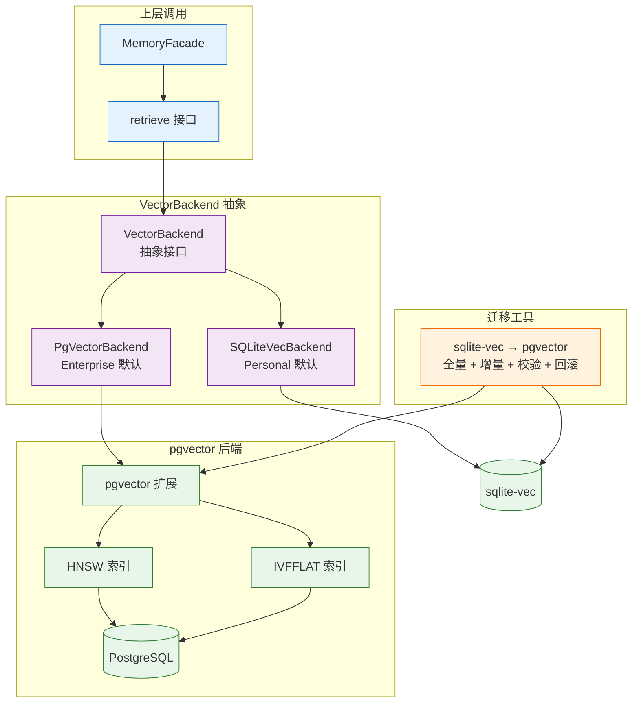
```mermaid
graph TB
    subgraph 上层调用
        MEM[MemoryFacade]
        RETRIEVE[retrieve 接口]
    end
    subgraph VectorBackend 抽象
        ABS[VectorBackend<br/>抽象接口]
        SQLITE_BE[SQLiteVecBackend<br/>Personal 默认]
        PG_BE[PgVectorBackend<br/>Enterprise 默认]
    end
    subgraph pgvector 后端
        PG[(PostgreSQL)]
        PGVEC[pgvector 扩展]
        HNSW_IDX[HNSW 索引]
        IVF_IDX[IVFFLAT 索引]
    end
    subgraph 迁移工具
        MIG[sqlite-vec → pgvector<br/>全量 + 增量 + 校验 + 回滚]
    end

    MEM --> RETRIEVE
    RETRIEVE --> ABS
    ABS --> SQLITE_BE
    ABS --> PG_BE
    SQLITE_BE --> SQLITE_VEC[(sqlite-vec)]
    PG_BE --> PGVEC
    PGVEC --> HNSW_IDX
    PGVEC --> IVF_IDX
    HNSW_IDX --> PG
    IVF_IDX --> PG
    MIG --> SQLITE_VEC
    MIG --> PGVEC

    classDef upper fill:#e3f2fd,stroke:#1565c0
    classDef abs fill:#f3e5f5,stroke:#7b1fa2
    classDef pg fill:#e8f5e9,stroke:#2e7d32
    classDef mig fill:#fff3e0,stroke:#ef6c00
    class MEM,RETRIEVE upper
    class ABS,SQLITE_BE,PG_BE abs
    class PG,PGVEC,HNSW_IDX,IVF_IDX,SQLITE_VEC pg
    class MIG mig
```

#### 2.2.2 VectorBackend 抽象接口

```python
# 代码示例：VectorBackend 抽象接口（Python）
from abc import ABC, abstractmethod
from typing import Sequence

class VectorBackend(ABC):
    """向量后端抽象，sqlite-vec 与 pgvector 实现此接口。"""

    @abstractmethod
    def insert(self, ids: Sequence[str], vectors: Sequence[list[float]],
               metadata: Sequence[dict]) -> None: ...

    @abstractmethod
    def search(self, query: list[float], top_k: int,
               filter: dict | None = None) -> list[SearchResult]: ...

    @abstractmethod
    def rebuild_index(self, index_type: str, params: dict) -> None: ...

    @abstractmethod
    def stats(self) -> VectorStats: ...
```

#### 2.2.3 索引策略

| 索引类型 | 适用场景 | 参数 | 召回 |
|----------|----------|------|------|
| HNSW | 低延迟、高召回、内存充足 | `m=16`, `ef_construction=64`, `ef_search=40` | recall@10 ≥ 0.95 |
| IVFFLAT | 大规模、内存敏感 | `lists=√N`, `probes=10` | recall@10 ≥ 0.90 |

#### 2.2.4 迁移路径

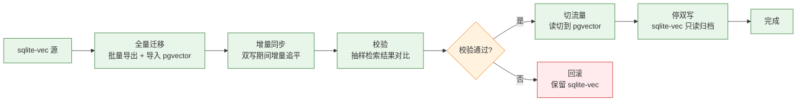
```mermaid
graph LR
    A[sqlite-vec 源] --> B[全量迁移<br/>批量导出 + 导入 pgvector]
    B --> C[增量同步<br/>双写期间增量追平]
    C --> D[校验<br/>抽样检索结果对比]
    D --> E{校验通过?}
    E -->|是| F[切流量<br/>读切到 pgvector]
    E -->|否| G[回滚<br/>保留 sqlite-vec]
    F --> H[停双写<br/>sqlite-vec 只读归档]
    H --> I[完成]

    classDef ok fill:#e8f5e9,stroke:#2e7d32
    classDef warn fill:#fff3e0,stroke:#ef6c00
    classDef bad fill:#ffebee,stroke:#c62828
    class A,B,C,D,F,H,I ok
    class E warn
    class G bad
```

### 2.3 记忆统一架构

#### 2.3.1 架构图

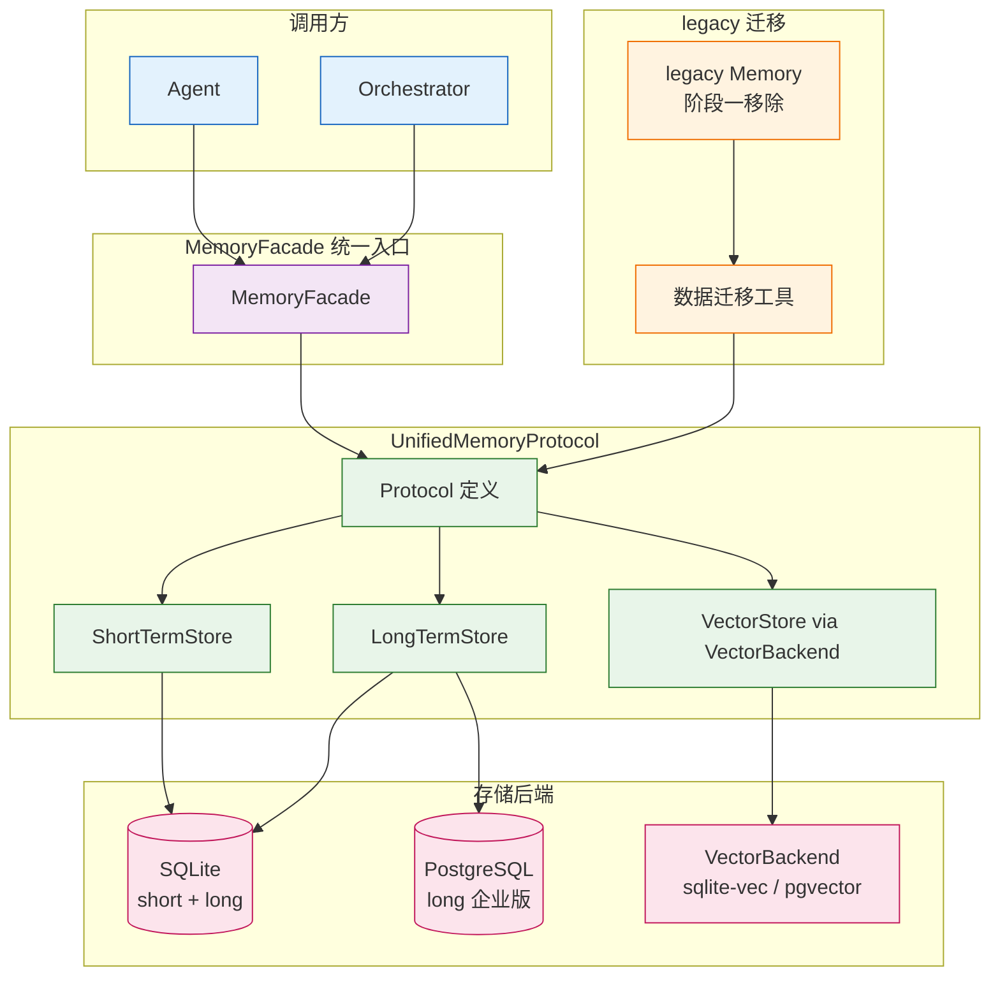
```mermaid
graph TB
    subgraph 调用方
        AGENT[Agent]
        ORCH[Orchestrator]
    end
    subgraph MemoryFacade 统一入口
        FACADE[MemoryFacade]
    end
    subgraph UnifiedMemoryProtocol
        PROTO[Protocol 定义]
        SHORT[ShortTermStore]
        LONG[LongTermStore]
        VEC[VectorStore via VectorBackend]
    end
    subgraph 存储后端
        SQLITE[(SQLite<br/>short + long)]
        PG[(PostgreSQL<br/>long 企业版)]
        VECBE[VectorBackend<br/>sqlite-vec / pgvector]
    end
    subgraph legacy 迁移
        LEGACY[legacy Memory<br/>阶段一移除]
        MIG[数据迁移工具]
    end

    AGENT --> FACADE
    ORCH --> FACADE
    FACADE --> PROTO
    PROTO --> SHORT
    PROTO --> LONG
    PROTO --> VEC
    SHORT --> SQLITE
    LONG --> SQLITE
    LONG --> PG
    VEC --> VECBE
    LEGACY --> MIG
    MIG --> PROTO

    classDef caller fill:#e3f2fd,stroke:#1565c0
    classDef facade fill:#f3e5f5,stroke:#7b1fa2
    classDef proto fill:#e8f5e9,stroke:#2e7d32
    classDef store fill:#fce4ec,stroke:#c2185b
    classDef mig fill:#fff3e0,stroke:#ef6c00
    class AGENT,ORCH caller
    class FACADE facade
    class PROTO,SHORT,LONG,VEC proto
    class SQLITE,PG,VECBE store
    class LEGACY,MIG mig
```

#### 2.3.2 MemoryFacade 接口

```python
# 代码示例：MemoryFacade 统一入口（Python）
class MemoryFacade:
    """记忆统一入口，屏蔽 short/long/vector 三层细节。"""

    def __init__(self, protocol: UnifiedMemoryProtocol): ...

    def remember(self, content: str, layer: MemoryLayer,
                 metadata: dict | None = None) -> str: ...

    def recall(self, query: str, top_k: int = 5,
               layers: list[MemoryLayer] | None = None) -> list[MemoryItem]: ...

    def forget(self, item_id: str) -> bool: ...

    def consolidate(self) -> None:
        """short → long 沉淀，long → vector 索引。"""
```

#### 2.3.3 迁移策略

1. **行为一致性测试先行**：编写 ≥ 200 用例覆盖 legacy 全部行为，作为迁移验收基线。
2. **数据迁移工具**：legacy 格式 → Unified 格式，支持增量 + 校验 + 回滚。
3. **灰度切换**：先双写（legacy + Unified），校验一致后切读到 Unified，最后停 legacy 写。
4. **legacy 移除**：切读稳定 N 周后删除 legacy 代码，`grep` 验证零残留。

### 2.4 可观测性架构

#### 2.4.1 架构图

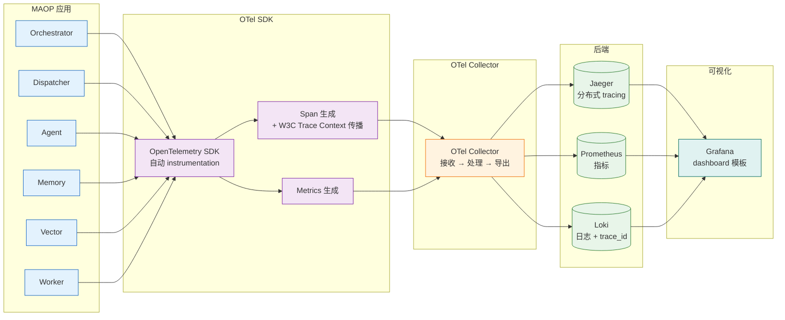
```mermaid
graph LR
    subgraph MAOP 应用
        ORCH[Orchestrator]
        DISP[Dispatcher]
        AGENT[Agent]
        MEM[Memory]
        VEC[Vector]
        WORKER[Worker]
    end
    subgraph OTel SDK
        SDK[OpenTelemetry SDK<br/>自动 instrumentation]
        SPAN[Span 生成<br/>+ W3C Trace Context 传播]
        METRIC[Metrics 生成]
    end
    subgraph OTel Collector
        COL[OTel Collector<br/>接收 → 处理 → 导出]
    end
    subgraph 后端
        JAEGER[(Jaeger<br/>分布式 tracing)]
        PROM[(Prometheus<br/>指标)]
        LOKI[(Loki<br/>日志 + trace_id)]
    end
    subgraph 可视化
        GRAF[Grafana<br/>dashboard 模板]
    end

    ORCH --> SDK
    DISP --> SDK
    AGENT --> SDK
    MEM --> SDK
    VEC --> SDK
    WORKER --> SDK
    SDK --> SPAN
    SDK --> METRIC
    SPAN --> COL
    METRIC --> COL
    COL --> JAEGER
    COL --> PROM
    COL --> LOKI
    JAEGER --> GRAF
    PROM --> GRAF
    LOKI --> GRAF

    classDef app fill:#e3f2fd,stroke:#1565c0
    classDef sdk fill:#f3e5f5,stroke:#7b1fa2
    classDef col fill:#fff3e0,stroke:#ef6c00
    classDef backend fill:#e8f5e9,stroke:#2e7d32
    classDef viz fill:#e0f2f1,stroke:#00695c
    class ORCH,DISP,AGENT,MEM,VEC,WORKER app
    class SDK,SPAN,METRIC sdk
    class COL col
    class JAEGER,PROM,LOKI backend
    class GRAF viz
```

#### 2.4.2 Span 模型

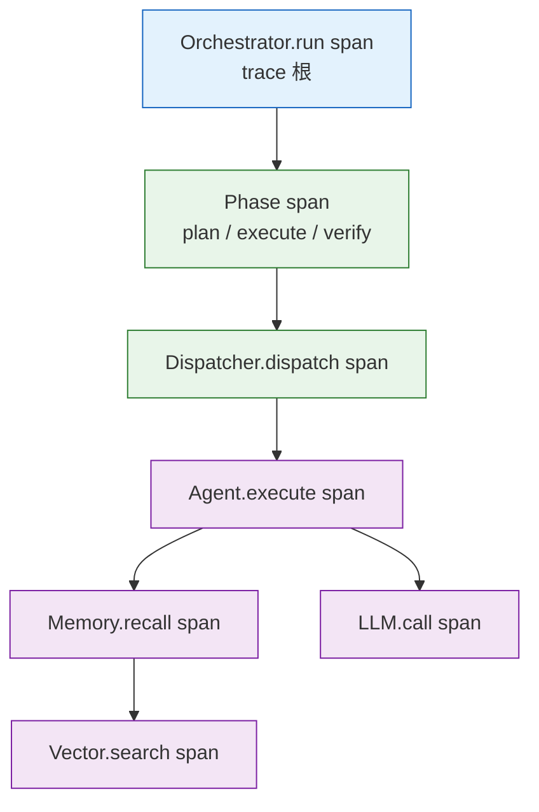
```mermaid
graph TB
    ORCH_SPAN[Orchestrator.run span<br/>trace 根]
    PHASE_SPAN[Phase span<br/>plan / execute / verify]
    DISP_SPAN[Dispatcher.dispatch span]
    AGENT_SPAN[Agent.execute span]
    MEM_SPAN[Memory.recall span]
    VEC_SPAN[Vector.search span]
    LLM_SPAN[LLM.call span]

    ORCH_SPAN --> PHASE_SPAN
    PHASE_SPAN --> DISP_SPAN
    DISP_SPAN --> AGENT_SPAN
    AGENT_SPAN --> MEM_SPAN
    AGENT_SPAN --> LLM_SPAN
    MEM_SPAN --> VEC_SPAN

    classDef root fill:#e3f2fd,stroke:#1565c0
    classDef phase fill:#e8f5e9,stroke:#2e7d32
    classDef leaf fill:#f3e5f5,stroke:#7b1fa2
    class ORCH_SPAN root
    class PHASE_SPAN,DISP_SPAN phase
    class AGENT_SPAN,MEM_SPAN,VEC_SPAN,LLM_SPAN leaf
```

#### 2.4.3 Grafana dashboard 模板

| dashboard | 核心面板 | 数据源 |
|-----------|----------|--------|
| 平台总览 | 编排 QPS、成功率、P50/P95/P99 延迟、活跃 worker 数 | Prometheus |
| 编排详情 | 单编排 span 瀑布图、阶段耗时分布、失败原因 top | Jaeger + Prometheus |
| 模型成本 | 按 model/agent/tenant 成本、预算消耗速率、降级触发次数 | Prometheus |
| 向量检索 | 检索 QPS、延迟分位数、recall 采样、索引大小 | Prometheus |

#### 2.4.4 关键配置

```yaml
# otel-collector-config.yaml
receivers:
  otlp:
    protocols:
      grpc:
        endpoint: 0.0.0.0:4317
      http:
        endpoint: 0.0.0.0:4318

processors:
  batch:
    timeout: 5s
    send_batch_size: 1024
  memory_limiter:
    check_interval: 1s
    limit_percentage: 80
    spike_limit_percentage: 25

exporters:
  jaeger:
    endpoint: jaeger:14250
    tls:
      insecure: true
  prometheus:
    endpoint: 0.0.0.0:8889
  loki:
    endpoint: loki:3100/loki/api/v1/push

service:
  pipelines:
    traces:
      receivers: [otlp]
      processors: [memory_limiter, batch]
      exporters: [jaeger]
    metrics:
      receivers: [otlp]
      processors: [memory_limiter, batch]
      exporters: [prometheus]
    logs:
      receivers: [otlp]
      processors: [memory_limiter, batch]
      exporters: [loki]
```

---

## 第3章 阶段二架构设计

### 3.1 自演化闭环架构

#### 3.1.1 架构图

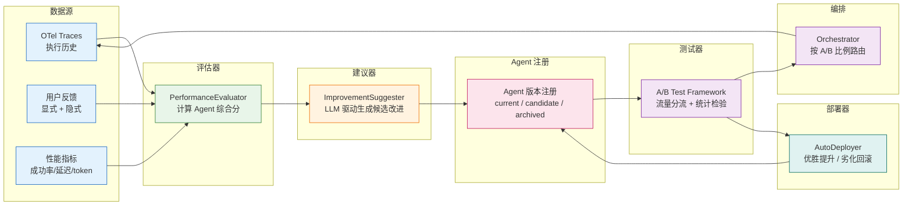
```mermaid
graph LR
    subgraph 数据源
        TRACE[OTel Traces<br/>执行历史]
        FEEDBACK[用户反馈<br/>显式 + 隐式]
        METRIC[性能指标<br/>成功率/延迟/token]
    end
    subgraph 评估器
        EVAL[PerformanceEvaluator<br/>计算 Agent 综合分]
    end
    subgraph 建议器
        SUGGEST[ImprovementSuggester<br/>LLM 驱动生成候选改进]
    end
    subgraph 测试器
        AB[A/B Test Framework<br/>流量分流 + 统计检验]
    end
    subgraph 部署器
        DEPLOY[AutoDeployer<br/>优胜提升 / 劣化回滚]
    end
    subgraph Agent 注册
        REG[Agent 版本注册<br/>current / candidate / archived]
    end
    subgraph 编排
        ORCH[Orchestrator<br/>按 A/B 比例路由]
    end

    TRACE --> EVAL
    FEEDBACK --> EVAL
    METRIC --> EVAL
    EVAL --> SUGGEST
    SUGGEST --> REG
    REG --> AB
    AB --> ORCH
    ORCH --> TRACE
    AB --> DEPLOY
    DEPLOY --> REG

    classDef src fill:#e3f2fd,stroke:#1565c0
    classDef eval fill:#e8f5e9,stroke:#2e7d32
    classDef suggest fill:#fff3e0,stroke:#ef6c00
    classDef test fill:#f3e5f5,stroke:#7b1fa2
    classDef deploy fill:#e0f2f1,stroke:#00695c
    classDef reg fill:#fce4ec,stroke:#c2185b
    class TRACE,FEEDBACK,METRIC src
    class EVAL eval
    class SUGGEST suggest
    class AB test
    class DEPLOY deploy
    class REG reg
    class ORCH test
```

#### 3.1.2 闭环状态机

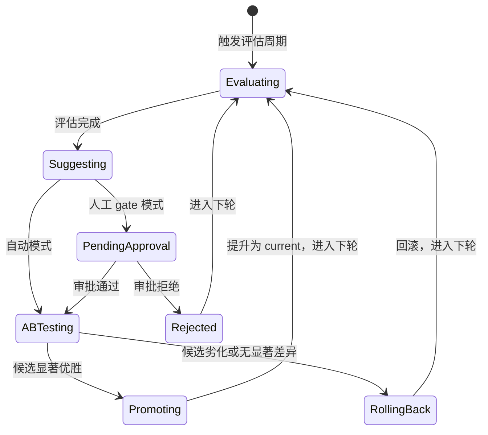
```mermaid
stateDiagram-v2
    [*] --> Evaluating: 触发评估周期
    Evaluating --> Suggesting: 评估完成
    Suggesting --> PendingApproval: 人工 gate 模式
    Suggesting --> ABTesting: 自动模式
    PendingApproval --> ABTesting: 审批通过
    PendingApproval --> Rejected: 审批拒绝
    ABTesting --> Promoting: 候选显著优胜
    ABTesting --> RollingBack: 候选劣化或无显著差异
    Promoting --> Evaluating: 提升为 current，进入下轮
    RollingBack --> Evaluating: 回滚，进入下轮
    Rejected --> Evaluating: 进入下轮
```

#### 3.1.3 A/B 统计检验

- **分流**：基于 `agent_id + trace_id` 哈希分桶，默认 10% candidate / 90% current，可配置。
- **指标**：综合分 = w1 × 成功率 + w2 × 速度归一 + w3 × token 效率归一 + w4 × 用户满意度。
- **检验**：序贯检验（sequential testing），避免固定样本量等待，达到显著性即决策。
- **决策**：p < 0.05 且候选优于 current → 提升；p < 0.05 且劣化 → 回滚；超时无显著 → 回滚（保守）。

### 3.2 多模态记忆架构

#### 3.2.1 架构图

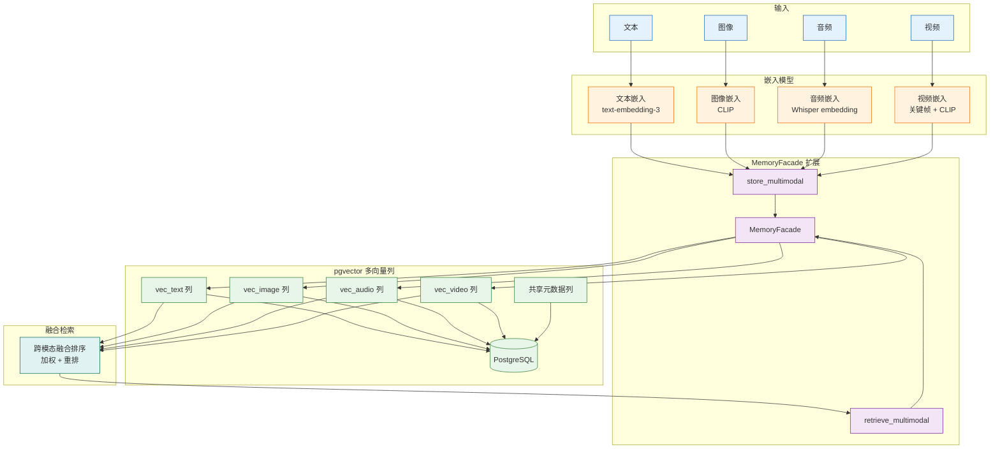
```mermaid
graph TB
    subgraph 输入
        TEXT[文本]
        IMG[图像]
        AUDIO[音频]
        VIDEO[视频]
    end
    subgraph 嵌入模型
        TEXT_EMB[文本嵌入<br/>text-embedding-3]
        IMG_EMB[图像嵌入<br/>CLIP]
        AUDIO_EMB[音频嵌入<br/>Whisper embedding]
        VIDEO_EMB[视频嵌入<br/>关键帧 + CLIP]
    end
    subgraph MemoryFacade 扩展
        FACADE[MemoryFacade]
        STORE_MM[store_multimodal]
        RET_MM[retrieve_multimodal]
    end
    subgraph pgvector 多向量列
        PG[(PostgreSQL)]
        VEC_TEXT[vec_text 列]
        VEC_IMG[vec_image 列]
        VEC_AUDIO[vec_audio 列]
        VEC_VIDEO[vec_video 列]
        META[共享元数据列]
    end
    subgraph 融合检索
        FUSE[跨模态融合排序<br/>加权 + 重排]
    end

    TEXT --> TEXT_EMB
    IMG --> IMG_EMB
    AUDIO --> AUDIO_EMB
    VIDEO --> VIDEO_EMB
    TEXT_EMB --> STORE_MM
    IMG_EMB --> STORE_MM
    AUDIO_EMB --> STORE_MM
    VIDEO_EMB --> STORE_MM
    STORE_MM --> FACADE
    RET_MM --> FACADE
    FACADE --> VEC_TEXT
    FACADE --> VEC_IMG
    FACADE --> VEC_AUDIO
    FACADE --> VEC_VIDEO
    VEC_TEXT --> PG
    VEC_IMG --> PG
    VEC_AUDIO --> PG
    VEC_VIDEO --> PG
    META --> PG
    VEC_TEXT --> FUSE
    VEC_IMG --> FUSE
    VEC_AUDIO --> FUSE
    VEC_VIDEO --> FUSE
    FUSE --> RET_MM

    classDef input fill:#e3f2fd,stroke:#1565c0
    classDef emb fill:#fff3e0,stroke:#ef6c00
    classDef facade fill:#f3e5f5,stroke:#7b1fa2
    classDef store fill:#e8f5e9,stroke:#2e7d32
    classDef fuse fill:#e0f2f1,stroke:#00695c
    class TEXT,IMG,AUDIO,VIDEO input
    class TEXT_EMB,IMG_EMB,AUDIO_EMB,VIDEO_EMB emb
    class FACADE,STORE_MM,RET_MM facade
    class PG,VEC_TEXT,VEC_IMG,VEC_AUDIO,VEC_VIDEO,META store
    class FUSE fuse
```

#### 3.2.2 融合检索策略

| 策略 | 说明 | 适用 |
|------|------|------|
| 加权融合 | 各模态检索结果按权重融合排序，权重可配置 | 默认，简单高效 |
| 重排 | 各模态 top-K 合并后用交叉编码器重排 | 高精度场景 |
| 模态门控 | 查询模态决定检索模态（文本查文本，图像查图像+文本） | 模态对齐场景 |

### 3.3 知识图谱推理架构

#### 3.3.1 架构图

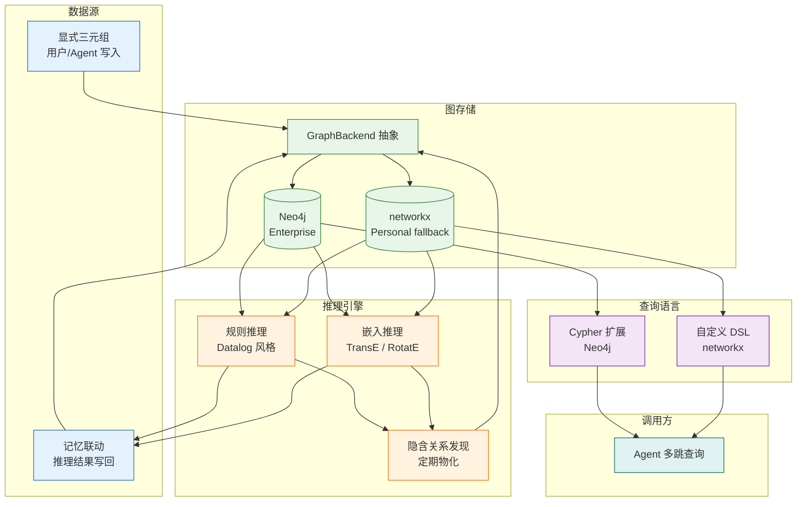
```mermaid
graph TB
    subgraph 数据源
        EXPLICIT[显式三元组<br/>用户/Agent 写入]
        MEM[记忆联动<br/>推理结果写回]
    end
    subgraph 图存储
        NEO[(Neo4j<br/>Enterprise)]
        NX[(networkx<br/>Personal fallback)]
        BACKEND[GraphBackend 抽象]
    end
    subgraph 推理引擎
        RULE[规则推理<br/>Datalog 风格]
        KGE[嵌入推理<br/>TransE / RotatE]
        DISCOVER[隐含关系发现<br/>定期物化]
    end
    subgraph 查询语言
        CYPHER[Cypher 扩展<br/>Neo4j]
        DSL[自定义 DSL<br/>networkx]
    end
    subgraph 调用方
        AGENT[Agent 多跳查询]
    end

    EXPLICIT --> BACKEND
    MEM --> BACKEND
    BACKEND --> NEO
    BACKEND --> NX
    NEO --> RULE
    NEO --> KGE
    NX --> RULE
    NX --> KGE
    RULE --> DISCOVER
    KGE --> DISCOVER
    DISCOVER --> BACKEND
    NEO --> CYPHER
    NX --> DSL
    CYPHER --> AGENT
    DSL --> AGENT
    RULE --> MEM
    KGE --> MEM

    classDef src fill:#e3f2fd,stroke:#1565c0
    classDef store fill:#e8f5e9,stroke:#2e7d32
    classDef engine fill:#fff3e0,stroke:#ef6c00
    classDef query fill:#f3e5f5,stroke:#7b1fa2
    classDef caller fill:#e0f2f1,stroke:#00695c
    class EXPLICIT,MEM src
    class NEO,NX,BACKEND store
    class RULE,KGE,DISCOVER engine
    class CYPHER,DSL query
    class AGENT caller
```

#### 3.3.2 双通道推理

- **规则通道**：Datalog 风格规则（如 `(A, 合作, B) ∧ (B, 导师, C) → (A, 合作者导师, C)`），确定性强、可解释，适合显式关系闭包。
- **嵌入通道**：KGE（TransE/RotatE）学习实体与关系嵌入，预测三元组置信度，适合隐含关系发现。
- **融合**：规则通道结果置信度 1.0，嵌入通道结果附带置信度，高置信（> 阈值）物化到图。

### 3.4 Plan 质量学习架构

#### 3.4.1 架构图

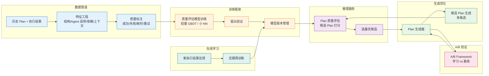
```mermaid
graph LR
    subgraph 数据管道
        HIST[历史 Plan + 执行结果]
        FEAT[特征工程<br/>结构/Agent 选择/依赖/上下文]
        LABEL[质量标注<br/>成功/失败/耗时/重试]
    end
    subgraph 训练框架
        TRAIN[质量评估模型训练<br/>轻量 GBDT / 小 NN]
        VAL[留出验证]
        VERSION[模型版本管理]
    end
    subgraph 推理服务
        INFER[Plan 质量评估<br/>候选 Plan 打分]
        SELECT[选最优候选]
    end
    subgraph 生成优化
        GEN[Plan 生成器]
        CAND[候选 Plan 生成<br/>多候选]
    end
    subgraph 在线学习
        FEEDBACK[新执行结果反馈]
        RETRAIN[定期再训练]
    end
    subgraph A/B 验证
        AB[A/B Framework<br/>学习 vs 基线]
    end

    HIST --> FEAT
    FEAT --> LABEL
    LABEL --> TRAIN
    TRAIN --> VAL
    VAL --> VERSION
    VERSION --> INFER
    INFER --> SELECT
    GEN --> CAND
    CAND --> INFER
    SELECT --> GEN
    FEEDBACK --> RETRAIN
    RETRAIN --> VERSION
    GEN --> AB
    AB --> GEN

    classDef data fill:#e3f2fd,stroke:#1565c0
    classDef train fill:#fff3e0,stroke:#ef6c00
    classDef infer fill:#f3e5f5,stroke:#7b1fa2
    classDef gen fill:#e8f5e9,stroke:#2e7d32
    classDef online fill:#e0f2f1,stroke:#00695c
    classDef ab fill:#fce4ec,stroke:#c2185b
    class HIST,FEAT,LABEL data
    class TRAIN,VAL,VERSION train
    class INFER,SELECT infer
    class GEN,CAND gen
    class FEEDBACK,RETRAIN online
    class AB ab
```

#### 3.4.2 模型选型

| 模型 | 说明 | 训练成本 | 推理延迟 |
|------|------|----------|----------|
| GBDT（LightGBM） | 表格特征，轻量高效 | 低（CPU 分钟级） | < 10ms |
| 小 NN（MLP） | 端到端学习 Plan 结构特征 | 中（GPU 小时级） | < 30ms |
| LLM-as-judge | 用 LLM 评估 Plan 质量（few-shot） | 零训练 | 100–500ms（贵） |

**推荐**：GBDT 为主（低成本、低延迟），LLM-as-judge 为辅（高精度场景）。

---

## 第4章 阶段三架构设计

### 4.1 Agent Marketplace 架构

#### 4.1.1 架构图

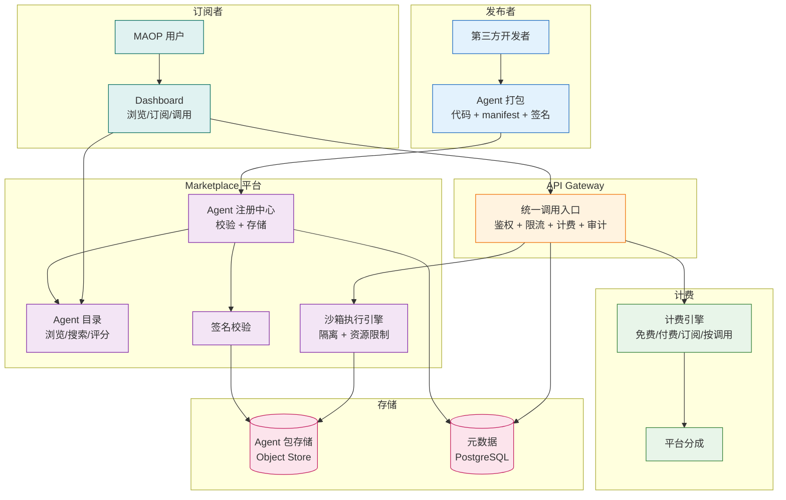
```mermaid
graph TB
    subgraph 发布者
        PUB[第三方开发者]
        PACK[Agent 打包<br/>代码 + manifest + 签名]
    end
    subgraph Marketplace 平台
        REG[Agent 注册中心<br/>校验 + 存储]
        DIR[Agent 目录<br/>浏览/搜索/评分]
        SIGN[签名校验]
        SANDBOX[沙箱执行引擎<br/>隔离 + 资源限制]
    end
    subgraph API Gateway
        GW[统一调用入口<br/>鉴权 + 限流 + 计费 + 审计]
    end
    subgraph 计费
        BILL[计费引擎<br/>免费/付费/订阅/按调用]
        SPLIT[平台分成]
    end
    subgraph 订阅者
        SUB[MAOP 用户]
        DASH[Dashboard<br/>浏览/订阅/调用]
    end
    subgraph 存储
        ARTIFACT[(Agent 包存储<br/>Object Store)]
        META[(元数据<br/>PostgreSQL)]
    end

    PUB --> PACK
    PACK --> REG
    REG --> SIGN
    SIGN --> ARTIFACT
    REG --> META
    REG --> DIR
    SUB --> DASH
    DASH --> DIR
    DASH --> GW
    GW --> SANDBOX
    SANDBOX --> ARTIFACT
    GW --> BILL
    BILL --> SPLIT
    GW --> META

    classDef pub fill:#e3f2fd,stroke:#1565c0
    classDef mkt fill:#f3e5f5,stroke:#7b1fa2
    classDef gw fill:#fff3e0,stroke:#ef6c00
    classDef bill fill:#e8f5e9,stroke:#2e7d32
    classDef sub fill:#e0f2f1,stroke:#00695c
    classDef store fill:#fce4ec,stroke:#c2185b
    class PUB,PACK pub
    class REG,DIR,SIGN,SANDBOX mkt
    class GW gw
    class BILL,SPLIT bill
    class SUB,DASH sub
    class ARTIFACT,META store
```

#### 4.1.2 沙箱执行设计

- **隔离**：每个第三方 Agent 在独立容器（gVisor / Firecracker microVM）执行，文件系统 / 网络 / 进程隔离。
- **资源限制**：CPU / 内存 / 网络带宽 / 执行时长配额，超限 kill。
- **权限**：最小权限，Agent manifest 声明所需能力（如 `memory.read`、`tool.http`），运行时按声明授权。
- **签名**：Agent 包需发布者签名，运行时校验签名 + 完整性，篡改拒绝。

### 4.2 Workflow Visual Builder 架构

#### 4.2.1 架构图

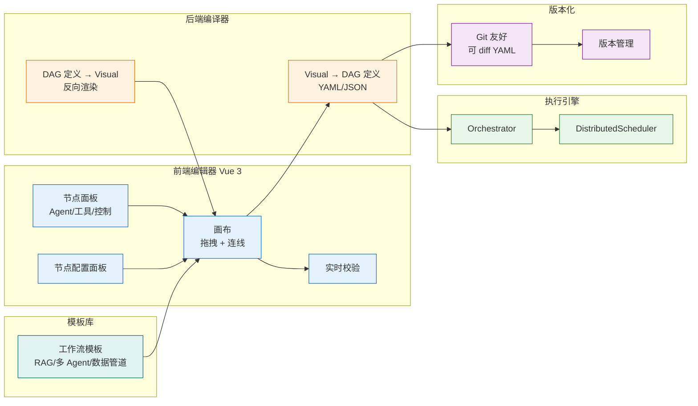
```mermaid
graph LR
    subgraph 前端编辑器 Vue 3
        CANVAS[画布<br/>拖拽 + 连线]
        PALETTE[节点面板<br/>Agent/工具/控制]
        CONFIG[节点配置面板]
        VALID_FE[实时校验]
    end
    subgraph 后端编译器
        COMPILER[Visual → DAG 定义<br/>YAML/JSON]
        DECOMP[DAG 定义 → Visual<br/>反向渲染]
    end
    subgraph 执行引擎
        ORCH[Orchestrator]
        DSCHED[DistributedScheduler]
    end
    subgraph 版本化
        GIT[Git 友好<br/>可 diff YAML]
        VERSION[版本管理]
    end
    subgraph 模板库
        TMPL[工作流模板<br/>RAG/多 Agent/数据管道]
    end

    CANVAS --> COMPILER
    PALETTE --> CANVAS
    CONFIG --> CANVAS
    CANVAS --> VALID_FE
    COMPILER --> ORCH
    ORCH --> DSCHED
    COMPILER --> GIT
    GIT --> VERSION
    DECOMP --> CANVAS
    TMPL --> CANVAS

    classDef fe fill:#e3f2fd,stroke:#1565c0
    classDef be fill:#fff3e0,stroke:#ef6c00
    classDef exec fill:#e8f5e9,stroke:#2e7d32
    classDef ver fill:#f3e5f5,stroke:#7b1fa2
    classDef tmpl fill:#e0f2f1,stroke:#00695c
    class CANVAS,PALETTE,CONFIG,VALID_FE fe
    class COMPILER,DECOMP be
    class ORCH,DSCHED exec
    class GIT,VERSION ver
    class TMPL tmpl
```

#### 4.2.2 Visual ↔ YAML 双向转换

- **正向**：Visual DAG（节点 + 连线 + 配置）→ MAOP DAG YAML（`nodes` + `edges` + `config`）。
- **反向**：DAG YAML → Visual DAG，用于导入已有 YAML 可视化编辑。
- **往返一致性**：Visual → YAML → Visual 必须 100% 一致（布局信息可选保留）。
- **Git 友好**：YAML 顺序稳定、字段顺序固定、diff 可读。

### 4.3 Multi-Tenant 架构

#### 4.3.1 架构图

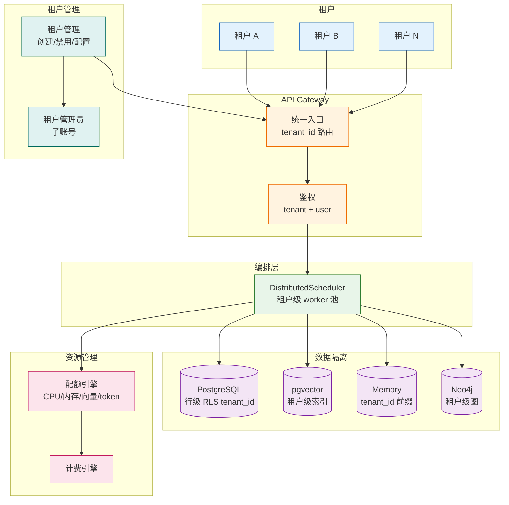
```mermaid
graph TB
    subgraph 租户
        T1[租户 A]
        T2[租户 B]
        T3[租户 N]
    end
    subgraph API Gateway
        GW[统一入口<br/>tenant_id 路由]
        AUTH[鉴权<br/>tenant + user]
    end
    subgraph 编排层
        DSCHED[DistributedScheduler<br/>租户级 worker 池]
    end
    subgraph 数据隔离
        DB[(PostgreSQL<br/>行级 RLS tenant_id)]
        VEC[(pgvector<br/>租户级索引)]
        MEM[(Memory<br/>tenant_id 前缀)]
        KG[(Neo4j<br/>租户级图)]
    end
    subgraph 资源管理
        QUOTA[配额引擎<br/>CPU/内存/向量/token]
        BILL[计费引擎]
    end
    subgraph 租户管理
        ADMIN[租户管理<br/>创建/禁用/配置]
        SUBADMIN[租户管理员<br/>子账号]
    end

    T1 --> GW
    T2 --> GW
    T3 --> GW
    GW --> AUTH
    AUTH --> DSCHED
    DSCHED --> DB
    DSCHED --> VEC
    DSCHED --> MEM
    DSCHED --> KG
    DSCHED --> QUOTA
    QUOTA --> BILL
    ADMIN --> GW
    ADMIN --> SUBADMIN

    classDef tenant fill:#e3f2fd,stroke:#1565c0
    classDef gw fill:#fff3e0,stroke:#ef6c00
    classDef orch fill:#e8f5e9,stroke:#2e7d32
    classDef data fill:#f3e5f5,stroke:#7b1fa2
    classDef res fill:#fce4ec,stroke:#c2185b
    classDef admin fill:#e0f2f1,stroke:#00695c
    class T1,T2,T3 tenant
    class GW,AUTH gw
    class DSCHED orch
    class DB,VEC,MEM,KG data
    class QUOTA,BILL res
    class ADMIN,SUBADMIN admin
```

#### 4.3.2 隔离策略

| 资源 | 隔离方式 | 说明 |
|------|----------|------|
| 数据库 | 行级安全（RLS，`tenant_id` 列） | 共享 schema，行级隔离，PG 原生支持 |
| 向量索引 | 租户级索引（`tenant_id` 过滤列） | 共享 pgvector，检索带 tenant 过滤 |
| 记忆 | `tenant_id` 前缀命名空间 | key 前缀隔离 |
| 知识图谱 | 租户级图（Neo4j 多数据库 / networkx 多图） | 图级隔离 |
| Worker | 租户级 worker 池（可配额共享或独占） | 资源隔离 |
| 配额 | 每租户 CPU/内存/向量/token 配额 | 超限拒绝或降级 |

#### 4.3.3 计费模型

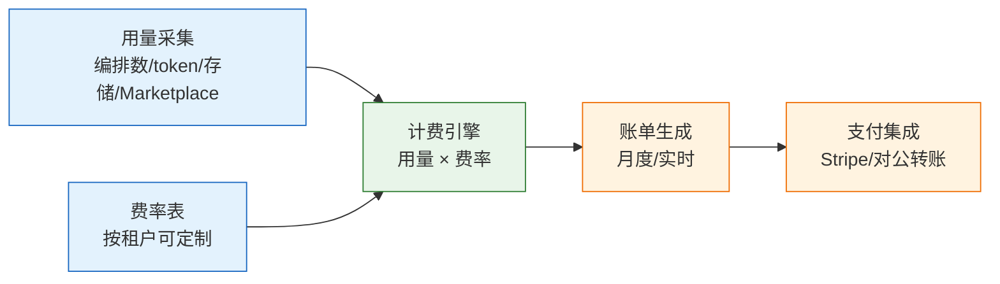
```mermaid
graph LR
    USAGE[用量采集<br/>编排数/token/存储/Marketplace]
    RATE[费率表<br/>按租户可定制]
    BILL[计费引擎<br/>用量 × 费率]
    INVOICE[账单生成<br/>月度/实时]
    PAY[支付集成<br/>Stripe/对公转账]

    USAGE --> BILL
    RATE --> BILL
    BILL --> INVOICE
    INVOICE --> PAY

    classDef src fill:#e3f2fd,stroke:#1565c0
    classDef bill fill:#e8f5e9,stroke:#2e7d32
    classDef out fill:#fff3e0,stroke:#ef6c00
    class USAGE,RATE src
    class BILL bill
    class INVOICE,PAY out
```

### 4.4 Federation 架构

#### 4.4.1 架构图

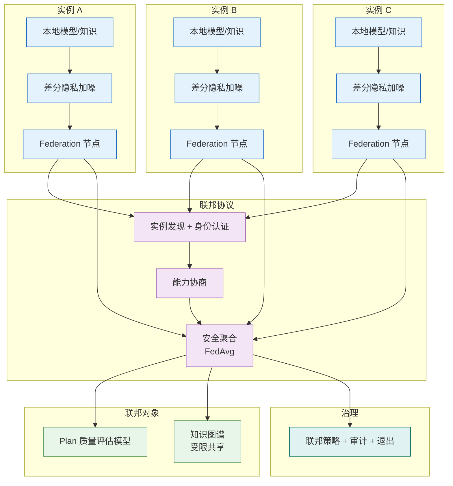
```mermaid
graph TB
    subgraph 实例 A
        LOCAL_A[本地模型/知识]
        FED_A[Federation 节点]
        DP_A[差分隐私加噪]
    end
    subgraph 实例 B
        LOCAL_B[本地模型/知识]
        FED_B[Federation 节点]
        DP_B[差分隐私加噪]
    end
    subgraph 实例 C
        LOCAL_C[本地模型/知识]
        FED_C[Federation 节点]
        DP_C[差分隐私加噪]
    end
    subgraph 联邦协议
        DISC[实例发现 + 身份认证]
        NEGOT[能力协商]
        AGG[安全聚合<br/>FedAvg]
    end
    subgraph 联邦对象
        MODEL[Plan 质量评估模型]
        KG[知识图谱<br/>受限共享]
    end
    subgraph 治理
        GOV[联邦策略 + 审计 + 退出]
    end

    LOCAL_A --> DP_A
    LOCAL_B --> DP_B
    LOCAL_C --> DP_C
    DP_A --> FED_A
    DP_B --> FED_B
    DP_C --> FED_C
    FED_A --> DISC
    FED_B --> DISC
    FED_C --> DISC
    DISC --> NEGOT
    NEGOT --> AGG
    AGG --> MODEL
    AGG --> KG
    AGG --> GOV
    FED_A --> AGG
    FED_B --> AGG
    FED_C --> AGG

    classDef inst fill:#e3f2fd,stroke:#1565c0
    classDef fed fill:#fff3e0,stroke:#ef6c00
    classDef proto fill:#f3e5f5,stroke:#7b1fa2
    classDef obj fill:#e8f5e9,stroke:#2e7d32
    classDef gov fill:#e0f2f1,stroke:#00695c
    class LOCAL_A,FED_A,DP_A,LOCAL_B,FED_B,DP_B,LOCAL_C,FED_C,DP_C inst
    class DISC,NEGOT,AGG proto
    class MODEL,KG obj
    class GOV gov
```

#### 4.4.2 隐私保护机制

- **差分隐私**：本地模型梯度/参数上传前加噪（Laplace / Gaussian 机制），ε 可配置，ε 越小隐私越强但效用越低。
- **安全聚合**：各实例上传加密梯度，聚合方仅能解密聚合结果，无法窥探单实例贡献（参考 Secure Aggregation 协议）。
- **知识联邦**：跨实例知识图谱查询仅返回受限共享三元组（按策略标记 `shareable=true`），隐私敏感三元组不出域。
- **退出机制**：实例可随时退出联邦，本地模型独立可用，联邦模型继续由剩余实例聚合。

### 4.5 LLM Cost Optimization 架构

#### 4.5.1 架构图

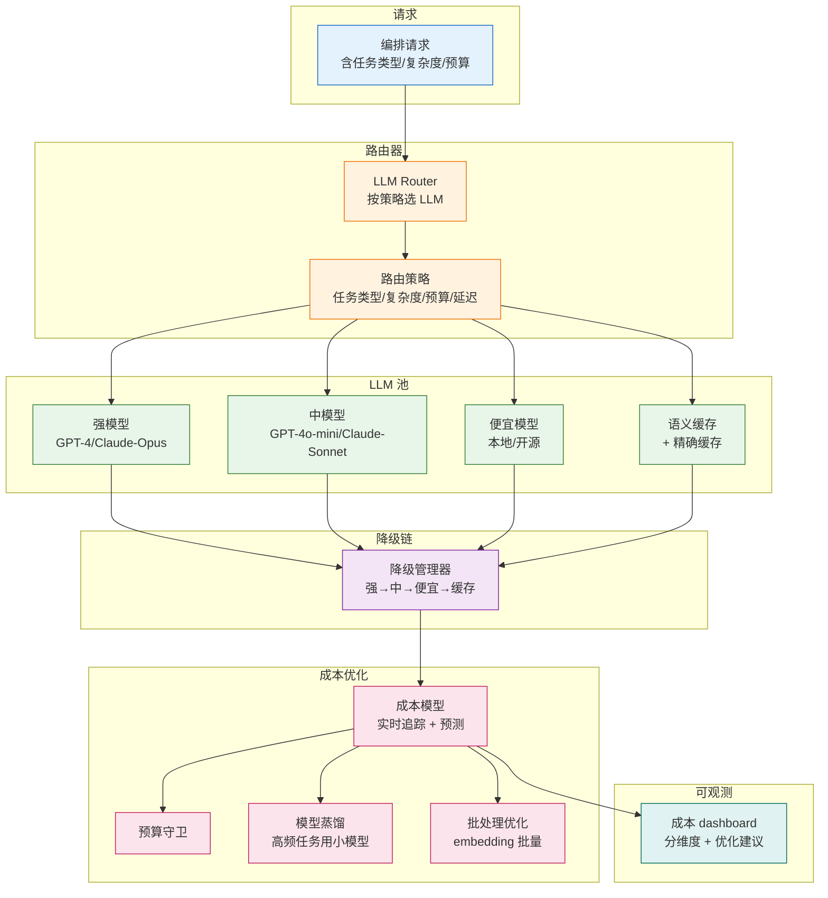
```mermaid
graph TB
    subgraph 请求
        REQ[编排请求<br/>含任务类型/复杂度/预算]
    end
    subgraph 路由器
        ROUTER[LLM Router<br/>按策略选 LLM]
        POLICY[路由策略<br/>任务类型/复杂度/预算/延迟]
    end
    subgraph LLM 池
        STRONG[强模型<br/>GPT-4/Claude-Opus]
        MID[中模型<br/>GPT-4o-mini/Claude-Sonnet]
        CHEAP[便宜模型<br/>本地/开源]
        CACHE[语义缓存<br/>+ 精确缓存]
    end
    subgraph 降级链
        FALLBACK[降级管理器<br/>强→中→便宜→缓存]
    end
    subgraph 成本优化
        COST[成本模型<br/>实时追踪 + 预测]
        BUDGET[预算守卫]
        DISTILL[模型蒸馏<br/>高频任务用小模型]
        BATCH[批处理优化<br/>embedding 批量]
    end
    subgraph 可观测
        DASH[成本 dashboard<br/>分维度 + 优化建议]
    end

    REQ --> ROUTER
    ROUTER --> POLICY
    POLICY --> STRONG
    POLICY --> MID
    POLICY --> CHEAP
    POLICY --> CACHE
    STRONG --> FALLBACK
    MID --> FALLBACK
    CHEAP --> FALLBACK
    CACHE --> FALLBACK
    FALLBACK --> COST
    COST --> BUDGET
    COST --> DASH
    COST --> DISTILL
    COST --> BATCH

    classDef req fill:#e3f2fd,stroke:#1565c0
    classDef router fill:#fff3e0,stroke:#ef6c00
    classDef llm fill:#e8f5e9,stroke:#2e7d32
    classDef fb fill:#f3e5f5,stroke:#7b1fa2
    classDef cost fill:#fce4ec,stroke:#c2185b
    classDef obs fill:#e0f2f1,stroke:#00695c
    class REQ req
    class ROUTER,POLICY router
    class STRONG,MID,CHEAP,CACHE llm
    class FALLBACK fb
    class COST,BUDGET,DISTILL,BATCH cost
    class DASH obs
```

#### 4.5.2 路由策略

| 策略 | 说明 | 示例 |
|------|------|------|
| 任务类型路由 | 按任务类型选模型 | 代码生成→强模型，摘要→中模型，分类→便宜模型 |
| 复杂度路由 | 按输入复杂度选模型 | 长 context→强模型，短→中模型 |
| 预算路由 | 按剩余预算选模型 | 预算紧→便宜模型，预算足→强模型 |
| 延迟路由 | 按延迟要求选模型 | 实时→便宜/缓存，离线→强模型 |
| 缓存优先 | 语义缓存命中直接返回 | 相似请求命中缓存 |

#### 4.5.3 降级链

```mermaid
graph LR
    A[强模型 GPT-4] -->|不可用/超预算/超时| B[中模型 GPT-4o-mini]
    B -->|不可用/超预算/超时| C[便宜模型 本地/开源]
    C -->|不可用| D[语义缓存]
    D -->|未命中| E[精确缓存]
    E -->|未命中| F[降级响应<br/>告知能力受限]

    classDef ok fill:#e8f5e9,stroke:#2e7d32
    classDef warn fill:#fff3e0,stroke:#ef6c00
    classDef bad fill:#ffebee,stroke:#c62828
    class A ok
    class B,C,D,E warn
    class F bad
```

---

## 第5章 技术选型建议

### 5.1 阶段一技术栈

| 组件 | 选型 | 理由 | 备选 |
|------|------|------|------|
| 任务队列 | Redis Streams | 已有 Redis 依赖，低运维 | RabbitMQ（Enterprise 可选） |
| Worker 通信 | gRPC / HTTP2 | 高效、流式、OTel 友好 | — |
| 状态存储 | Redis / etcd | 已有 Redis；etcd 用于强一致 | — |
| 向量后端 | pgvector + HNSW | PG 原生扩展，百万级，HNSW 高召回 | Milvus（更重） |
| OTel Collector | OTel Collector 官方 | 标准组件 | — |
| Tracing 后端 | Jaeger | 开源、OTel 原生 | Tempo |
| 指标后端 | Prometheus | 标准 | — |
| 日志后端 | Loki | 与 Grafana 一体 | ELK |
| 可视化 | Grafana | 标准 | — |

### 5.2 阶段二技术栈

| 组件 | 选型 | 理由 | 备选 |
|------|------|------|------|
| A/B 统计检验 | 自研（序贯检验） | 轻场景定制 | GrowthBook |
| 图像嵌入 | CLIP（OpenAI / 开源） | 多模态对齐标准 | — |
| 音频嵌入 | Whisper encoder | 开源、强 | — |
| 视频嵌入 | 关键帧 + CLIP | 复用 CLIP | — |
| 图存储 | Neo4j（Enterprise）/ networkx（Personal） | Neo4j 成熟、Cypher；networkx 零依赖 | NebulaGraph |
| KGE | DGL / PyTorch Geometric | 标准 GNN 库 | — |
| Plan 质量模型 | LightGBM | 表格特征、轻量、低延迟 | 小 NN |
| 训练框架 | PyTorch | 标准 | — |

### 5.3 阶段三技术栈

| 组件 | 选型 | 理由 | 备选 |
|------|------|------|------|
| Marketplace 存储 | Object Store（S3 / MinIO） | 大文件、版本化 | — |
| 沙箱 | gVisor / Firecracker microVM | 强隔离、低开销 | Docker（弱隔离） |
| API Gateway | Kong / 自研 | 鉴权 + 限流 + 计费 | — |
| 计费 | Stripe + 自研 | 国际 + 对公 | — |
| Visual Builder 前端 | Vue 3 + VueFlow / Drawflow | 已有 Vue 3 | React Flow |
| 多租户隔离 | PG RLS | PG 原生、强 | schema-per-tenant |
| 联邦协议 | 自研 + gRPC | 跨场景定制 | Flower |
| 安全聚合 | 自研 + SECN | 隐私保护 | — |
| LLM 路由 | 自研（已有 ModelSelector 扩展） | 复用现有 | LiteLLM |
| 语义缓存 | GPTCache / 自研 | 语义相似命中 | — |

---

## 第6章 数据流与接口设计

### 6.1 阶段一关键数据流

#### 6.1.1 分布式编排数据流

```mermaid
sequenceDiagram
    participant C as Client
    participant O as Orchestrator
    participant S as DistributedScheduler
    participant Q as TaskQueue
    participant W as Worker
    participant R as ResultStore
    participant T as OTel

    C->>O: run(dag)
    O->>T: start span: orchestrator.run
    O->>S: submit(dag)
    S->>Q: enqueue(tasks)
    Q->>W: dispatch(task)
    W->>T: start span: worker.execute
    W->>W: execute(task)
    W->>R: write(result)
    W->>T: end span
    W->>Q: ack(task)
    Q->>S: task_done
    S->>O: all_done
    O->>T: end span
    O->>C: result
```

#### 6.1.2 向量检索数据流

```mermaid
sequenceDiagram
    participant A as Agent
    participant M as MemoryFacade
    participant V as VectorBackend
    participant P as pgvector
    participant O as OTel

    A->>M: recall(query, top_k)
    M->>O: start span: memory.recall
    M->>V: search(query, top_k)
    V->>O: start span: vector.search
    V->>P: SELECT ... ORDER BY vec <=> query LIMIT k
    P-->>V: results
    V->>O: end span
    V-->>M: results
    M->>O: end span
    M-->>A: results
```

### 6.2 阶段二关键数据流

#### 6.2.1 自演化闭环数据流

```mermaid
sequenceDiagram
    participant T as OTel Traces
    participant E as Evaluator
    participant S as Suggester
    participant R as Agent Registry
    participant AB as A/B Framework
    participant O as Orchestrator
    participant D as Deployer

    Note over E: 每日评估周期
    T->>E: fetch_traces(agent_id, window)
    E->>E: compute_score(metrics)
    E->>S: suggest_improvements(score)
    S->>S: llm_generate_candidates()
    S->>R: register_candidate(version)
    R->>AB: start_experiment(candidate, current)
    Note over AB: 持续 A/B 流量
    AB->>O: route(10% candidate, 90% current)
    O->>T: emit traces
    T->>AB: collect outcomes
    AB->>AB: sequential_test()
    AB->>D: promote() or rollback()
    D->>R: update current version
```

### 6.3 阶段三关键数据流

#### 6.3.1 Marketplace 调用数据流

```mermaid
sequenceDiagram
    participant U as User
    participant GW as API Gateway
    participant AUTH as Auth
    participant SANDBOX as Sandbox
    participant AGENT as Agent
    participant BILL as Billing
    participant AUDIT as Audit

    U->>GW: invoke(agent_id, input)
    GW->>AUTH: verify(token, tenant, quota)
    AUTH-->>GW: ok
    GW->>BILL: record_start(agent_id, tenant)
    GW->>SANDBOX: spawn(agent_id, input)
    SANDBOX->>AGENT: execute(input)
    AGENT-->>SANDBOX: result
    SANDBOX-->>GW: result
    GW->>BILL: record_end(usage)
    GW->>AUDIT: log(actor, action, target)
    GW-->>U: result
```

#### 6.3.2 联邦学习数据流

```mermaid
sequenceDiagram
    participant A as Instance A
    participant B as Instance B
    participant C as Instance C
    participant AGG as Secure Aggregator

    Note over A,B,C: 联邦轮次开始
    A->>A: local_train(model)
    B->>B: local_train(model)
    C->>C: local_train(model)
    A->>A: dp_noise(gradients)
    B->>B: dp_noise(gradients)
    C->>C: dp_noise(gradients)
    A->>AGG: encrypt(gradients)
    B->>AGG: encrypt(gradients)
    C->>AGG: encrypt(gradients)
    AGG->>AGG: secure_aggregate()
    AGG-->>A: aggregated_update
    AGG-->>B: aggregated_update
    AGG-->>C: aggregated_update
    A->>A: apply_update()
    B->>B: apply_update()
    C->>C: apply_update()
```

### 6.4 核心接口契约

#### 6.4.1 阶段一新增接口

```python
# 代码示例：分布式执行接口（Python）
class DistributedScheduler:
    def submit(self, dag: DAG, priority: int = 0) -> JobId: ...
    def status(self, job_id: JobId) -> JobStatus: ...
    def cancel(self, job_id: JobId) -> bool: ...

class Worker:
    def register(self, capabilities: dict) -> WorkerId: ...
    def heartbeat(self) -> None: ...
    def execute(self, task: Task) -> Result: ...

# 代码示例：向量后端接口（Python）
class VectorBackend(ABC):
    def insert(self, ids, vectors, metadata) -> None: ...
    def search(self, query, top_k, filter=None) -> list[SearchResult]: ...
    def rebuild_index(self, index_type, params) -> None: ...

# 代码示例：记忆统一接口（Python）
class MemoryFacade:
    def remember(self, content, layer, metadata=None) -> str: ...
    def recall(self, query, top_k=5, layers=None) -> list[MemoryItem]: ...
    def forget(self, item_id) -> bool: ...
```

#### 6.4.2 阶段二新增接口

```python
# 代码示例：自演化接口（Python）
class PerformanceEvaluator:
    def evaluate(self, agent_id, window) -> Score: ...

class ImprovementSuggester:
    def suggest(self, score) -> list[Candidate]: ...

class ABTestFramework:
    def start_experiment(self, candidate, current, ratio=0.1) -> ExperimentId: ...
    def check_significance(self, exp_id) -> Decision: ...

# 代码示例：多模态记忆接口（Python）
class MemoryFacade:
    def store_multimodal(self, content, modality, metadata=None) -> str: ...
    def retrieve_multimodal(self, query, top_k=5, modalities=None) -> list[MultiModalItem]: ...

# 代码示例：知识图谱推理接口（Python）
class KnowledgeGraph:
    def query(self, q: str, hops: int = 2) -> list[Triple]: ...
    def infer(self, rules: list[Rule]) -> list[InferredTriple]: ...
```

#### 6.4.3 阶段三新增接口

```python
# 代码示例：Marketplace 接口（Python）
class AgentMarketplace:
    def publish(self, agent_package: SignedPackage) -> AgentId: ...
    def subscribe(self, agent_id: AgentId, plan: Plan) -> SubscriptionId: ...
    def invoke(self, agent_id: AgentId, input: dict) -> Result: ...

# 代码示例：Multi-Tenant 接口（Python）
class TenantManager:
    def create_tenant(self, config: TenantConfig) -> TenantId: ...
    def set_quota(self, tenant_id, quota: Quota) -> None: ...
    def bill(self, tenant_id, period) -> Invoice: ...

# 代码示例：Federation 接口（Python）
class FederationNode:
    def join(self, federation_id, credentials) -> None: ...
    def contribute(self, local_update) -> None: ...
    def leave(self) -> None: ...
```

---

## 第7章 部署架构演进

### 7.1 阶段一部署架构

```mermaid
graph TB
    subgraph K8s 集群
        subgraph 控制面
            API[MAOP API + Orchestrator]
            SCHED[DistributedScheduler]
        end
        subgraph Worker 节点
            W1[Worker Pod 1]
            W2[Worker Pod 2]
            WN[Worker Pod N]
        end
        subgraph 数据
            PG[(PostgreSQL + pgvector)]
            REDIS[(Redis)]
        end
        subgraph 可观测
            OTEL[OTel Collector]
            JAEGER[Jaeger]
            PROM[Prometheus]
            GRAF[Grafana]
        end
    end

    API --> SCHED
    SCHED --> REDIS
    SCHED --> W1
    SCHED --> W2
    SCHED --> WN
    W1 --> PG
    W2 --> PG
    WN --> PG
    W1 --> OTEL
    W2 --> OTEL
    WN --> OTEL
    API --> OTEL
    OTEL --> JAEGER
    OTEL --> PROM
    PROM --> GRAF
    JAEGER --> GRAF

    classDef ctrl fill:#e3f2fd,stroke:#1565c0
    classDef worker fill:#fff3e0,stroke:#ef6c00
    classDef data fill:#e8f5e9,stroke:#2e7d32
    classDef obs fill:#f3e5f5,stroke:#7b1fa2
    class API,SCHED ctrl
    class W1,W2,WN worker
    class PG,REDIS data
    class OTEL,JAEGER,PROM,GRAF obs
```

### 7.2 阶段三部署架构（多区域 SaaS）

```mermaid
graph TB
    subgraph 区域 A 主
        subgraph 控制面
            GW[API Gateway + Multi-Tenant]
            MKT[Marketplace]
            FED[Federation Node]
        end
        subgraph 工作面
            ORCH[Orchestrator + Worker Pool]
        end
        subgraph 数据
            PG[(PostgreSQL + pgvector)]
            NEO[(Neo4j)]
            OBJ[(Object Store)]
        end
    end
    subgraph 区域 B 从
        ORCH_B[Orchestrator + Worker Pool]
        PG_B[(PostgreSQL + pgvector)]
    end
    subgraph 联邦
        FED_A[实例 A Federation]
        FED_B[实例 B Federation]
        FED_C[实例 C Federation]
    end

    GW --> MKT
    GW --> ORCH
    ORCH --> PG
    ORCH --> NEO
    MKT --> OBJ
    GW --> FED
    FED --> FED_A
    ORCH_B --> PG_B
    GW -.跨区域同步.-> ORCH_B
    FED_A <--> FED_B
    FED_B <--> FED_C
    FED_A <--> FED_C

    classDef ctrl fill:#e3f2fd,stroke:#1565c0
    classDef work fill:#fff3e0,stroke:#ef6c00
    classDef data fill:#e8f5e9,stroke:#2e7d32
    classDef fed fill:#f3e5f5,stroke:#7b1fa2
    class GW,MKT,FED ctrl
    class ORCH,ORCH_B work
    class PG,NEO,OBJ,PG_B data
    class FED_A,FED_B,FED_C fed
```

### 7.3 部署演进路径

| 阶段 | 部署形态 | 关键变化 |
|------|----------|----------|
| 基线 v5.0.0 | 单进程 / docker-compose | — |
| 阶段一 v6.0.0 | K8s 单集群 + 多 Worker Pod + PG + Redis + 可观测栈 | 引入 K8s 生产部署 |
| 阶段二 v7.0.0 | K8s + GPU 节点（训练） + Neo4j | 新增 GPU 训练节点、图存储 |
| 阶段三 v8.0.0 | 多区域 K8s + Multi-Tenant + Marketplace + Federation | 多区域、SaaS、联邦 |

---

## 第8章 评审与签署

### 8.1 评审清单

- [ ] 架构委员会评审（架构合理性、技术选型、演进路径）
- [ ] SRE 评审（部署可行性、可观测性、容量规划、运维成本）
- [ ] 安全评审（沙箱、隔离、隐私、联邦、签名）
- [ ] 性能评审（延迟、吞吐、规模指标可达性）
- [ ] 兼容性评审（API 兼容、数据迁移、回滚）

### 8.2 签署

| 角色 | 签署人 | 状态 | 日期 |
|------|--------|------|------|
| 架构负责人 | TBD | Pending | — |
| SRE 负责人 | TBD | Pending | — |
| 安全负责人 | TBD | Pending | — |
| 性能负责人 | TBD | Pending | — |
| 工程负责人 | TBD | Pending | — |

---

## 附录 A：架构决策记录（ADR）索引

| ADR 编号 | 标题 | 阶段 | 状态 |
|----------|------|------|------|
| ADR-017 | 分布式执行任务队列选型（Redis Streams） | 阶段一 | Proposed |
| ADR-018 | 向量后端抽象与 pgvector 迁移策略 | 阶段一 | Proposed |
| ADR-019 | UnifiedMemoryProtocol 全量迁移与 legacy 移除 | 阶段一 | Proposed |
| ADR-020 | OTel 采样策略与开销控制 | 阶段一 | Proposed |
| ADR-021 | 自演化闭环 A/B 统计检验方法（序贯检验） | 阶段二 | Proposed |
| ADR-022 | 多模态嵌入模型选型与可切换 | 阶段二 | Proposed |
| ADR-023 | 知识图谱双通道推理（规则 + KGE） | 阶段二 | Proposed |
| ADR-024 | Plan 质量评估模型选型（GBDT 为主） | 阶段二 | Proposed |
| ADR-025 | Marketplace 沙箱隔离技术选型（gVisor / Firecracker） | 阶段三 | Proposed |
| ADR-026 | Multi-Tenant 隔离策略（PG RLS） | 阶段三 | Proposed |
| ADR-027 | Federation 隐私保护机制（差分隐私 + 安全聚合） | 阶段三 | Proposed |
| ADR-028 | LLM Cost Optimization 路由与降级链设计 | 阶段三 | Proposed |

## 附录 B：术语表

| 术语 | 全称 | 说明 |
|------|------|------|
| MAOP | Multi-Agent Orchestration Platform | 多代理编排平台 |
| DAG | Directed Acyclic Graph | 有向无环图 |
| OTel | OpenTelemetry | 开源可观测性框架 |
| pgvector | — | PostgreSQL 向量扩展 |
| HNSW | Hierarchical Navigable Small World | 向量索引算法 |
| IVFFLAT | Inverted File with Flat Compression | 向量索引算法 |
| KGE | Knowledge Graph Embedding | 知识图谱嵌入 |
| TransE / RotatE | — | KGE 代表算法 |
| FedAvg | Federated Averaging | 联邦平均算法 |
| RLS | Row-Level Security | 行级安全（PG） |
| gVisor | — | Google 沙箱运行时 |
| Firecracker | — | AWS microVM |
| CLIP | Contrastive Language-Image Pretraining | 多模态嵌入模型 |
| GBDT | Gradient Boosting Decision Tree | 梯度提升树 |
| CRD | Custom Resource Definition | K8s 自定义资源定义 |

## 附录 C：变更历史

| 版本 | 日期 | 变更内容 | 作者 |
|------|------|----------|------|
| v1.0.0-draft | 2026-08-07 | 初始草案，覆盖三阶段全部架构设计 | MAOP 高级技术文档专家 |