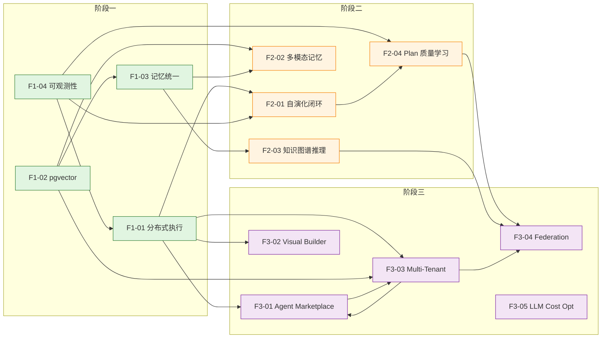
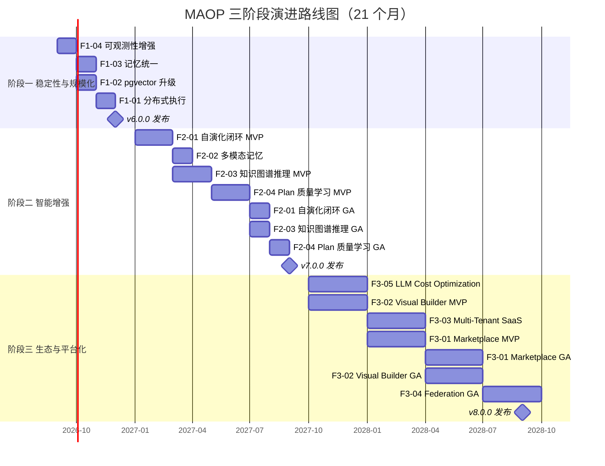

# MAOP 三阶段演进路线图 — 产品需求文档（PRD）

## 文档信息

| 字段 | 值 |
|------|-----|
| 文档名称 | MAOP 三阶段演进路线图 PRD |
| 版本 | v1.0.0-draft |
| 发布日期 | 2026-08-07 |
| 作者 | MAOP 高级技术文档专家 |
| 状态 | Draft - Pending Review |
| 适用范围 | MAOP Personal Edition + Enterprise Edition |
| 评审人 | TBD（待指定产品委员会 + 架构委员会） |
| 关联文档 | [ROADMAP.md](../ROADMAP.md)、[hld-three-phase-roadmap.md](./hld-three-phase-roadmap.md)、[platform-evolution.md](./platform-evolution.md) |
| 文档约定 | Markdown heading：H1 文档名 / H2 章 / H3 节 / H4 子节 / H5 子子节；图表使用 Mermaid 语法 |

---

## 第1章 执行摘要

### 1.1 路线图概述

MAOP（Multi-Agent Orchestration Platform）在完成 P0–P4 代码优化与 P0–P1 问题修复后，已具备稳定的多代理编排、三层记忆、向量检索、模型管理与控制面能力。本 PRD 定义未来 **21 个月** 的三阶段演进路线图，目标是将 MAOP 从"单机稳定编排框架"演进为"分布式智能体优化平台生态"。

### 1.2 三阶段一览

| 阶段 | 时间窗 | 主题 | 核心目标 | 关键交付 |
|------|--------|------|----------|----------|
| 阶段一 | Month 1–3（3 个月） | 稳定性与规模化 | 从单机走向分布式，从万级走向百万级 | 分布式执行、pgvector、UnifiedMemoryProtocol、OTel 可观测性 |
| 阶段二 | Month 4–9（6 个月） | 智能增强 | 从被动执行走向自演化，从单模态走向多模态 | 自演化闭环、多模态记忆、知识图谱推理、Plan 质量学习 |
| 阶段三 | Month 10–21（12 个月） | 生态与平台化 | 从产品走向平台，从单租户走向生态 | Agent Marketplace、Visual Builder、Multi-Tenant SaaS、Federation、LLM Cost Optimization |

### 1.3 价值主张

- **阶段一**：让 MAOP 能在生产规模下稳定承载 10× 以上并发编排任务，并提供工业级可观测性。
- **阶段二**：让 MAOP 具备"自我变好"的能力——Agent 能评估自身、提出改进、A/B 验证、自动部署。
- **阶段三**：让 MAOP 成为智能体生态的承载平台，第三方可发布 Agent、用户可订阅计费、多实例可联邦协作。

### 1.4 关键假设

1. 阶段一启动时 MAOP 已稳定发布 v5.0.0（major，废弃清理完成）。
2. 团队规模：阶段一 6–8 人，阶段二 10–12 人，阶段三 15–20 人（含 SRE、前端、平台）。
3. 基础设施：阶段一引入 Kubernetes 生产集群；阶段二引入 GPU 训练节点；阶段三引入多区域部署。
4. 预算：阶段一以基础设施迁移成本为主；阶段二以训练与推理成本为主；阶段三以平台运营成本为主。

---

## 第2章 背景与动机

### 2.1 当前状态

截至 2026-08-07，MAOP 已交付：

- **核心能力**：Plan-Execute-Verify 循环、DAG 工作流、流式进度推送、三层记忆（short/long/vector）、向量检索（sqlite-vec/HNSW）、模型管理（注册中心 + 选择器 + 降级 + 配额 + 预算）、控制面（审计 + 统一控制）、MCP Hub、插件系统、热重载。
- **质量基线**：覆盖率 87%，6130 测试通过，mypy 零 error，ruff 零告警。
- **架构形态**：单进程执行、SQLite + JSON + YAML 数据层、sqlite-vec 向量、双套记忆系统（legacy + UnifiedMemoryProtocol 并存）。
- **双版架构**：Personal（MIT）+ Enterprise（Commercial），运行时 Edition 检测，FeatureFlag 统一 gate。

### 2.2 核心痛点

| 痛点编号 | 痛点描述 | 影响阶段 | 严重度 |
|----------|----------|----------|--------|
| P-01 | 单进程 DAG 调度无法横向扩展，单机吞吐上限约 50 并发编排 | 阶段一 | High |
| P-02 | sqlite-vec 在 10 万向量以上检索延迟劣化（P95 > 500ms），无法支撑百万级知识库 | 阶段一 | High |
| P-03 | 双套记忆系统残留导致行为不一致、维护成本翻倍、bug 难以定位 | 阶段一 | High |
| P-04 | 缺乏分布式 tracing，跨 Agent / 跨阶段问题定位依赖日志肉眼拼接 | 阶段一 | High |
| P-05 | Agent 行为固定，无法基于执行反馈自动改进，依赖人工调优 | 阶段二 | Medium |
| P-06 | 记忆仅支持文本模态，图像/音频/视频上下文无法进入记忆 | 阶段二 | Medium |
| P-07 | 知识图谱仅存储显式关系，隐含关系需人工建模，多跳推理缺失 | 阶段二 | Medium |
| P-08 | Plan 生成依赖固定模板，无法从历史执行数据中学习最优策略 | 阶段二 | Medium |
| P-09 | Agent 能力封闭，第三方无法发布/订阅/计费，生态无法形成 | 阶段三 | Low（当前）/ High（战略） |
| P-10 | 工作流编排依赖 YAML/代码，非技术用户无法自助构建 | 阶段三 | Medium |
| P-11 | 单租户部署，企业 SaaS 化需求无法满足 | 阶段三 | High（战略） |
| P-12 | 多 MAOP 实例间无法协作，跨组织知识无法联邦 | 阶段三 | Medium |
| P-13 | LLM 成本随用量线性增长，缺乏路由/降级/缓存优化策略 | 阶段三 | High |

### 2.3 演进驱动力

1. **用户规模驱动**：早期采用者已突破单机承载能力，需分布式支撑。
2. **数据规模驱动**：知识库与记忆库持续膨胀，向量检索需百万级支撑。
3. **智能期望驱动**：用户期望 Agent "越用越聪明"，而非固定行为。
4. **生态战略驱动**：智能体市场正在形成（参照 Hugging Face / LangChain Hub），MAOP 需抢占生态位。
5. **成本压力驱动**：LLM 调用成本已成为 MAOP 运营 Top-3 成本，需系统性优化。

### 2.4 非目标（Non-Goals）

为聚焦路线图，明确以下为**非目标**：

- 不替换 Python 为其他主语言（Go/Rust 仅用于特定高性能组件）。
- 不自研 LLM，始终以集成第三方 LLM 为主。
- 不构建通用数据库，pgvector 仅用于向量场景。
- 不做通用 K8s 发行版，K8s 仅作为部署载体。
- 阶段一不引入多租户（留待阶段三）。
- 阶段二不做 Agent Marketplace（留待阶段三）。

---

## 第3章 阶段一：稳定性与规模化（Month 1–3）

### 3.1 阶段目标

将 MAOP 从单机编排框架演进为分布式可观测平台，吞吐提升 10×，向量检索支撑百万级，记忆系统统一为单一协议，可观测性达到工业级标准。

### 3.2 特性 F1-01：分布式执行

#### 3.2.1 用户故事

- **作为** 平台运维工程师，**我希望** MAOP 编排任务能跨多节点分发执行，**以便** 在单机无法承载高并发时横向扩展。
- **作为** 应用开发者，**我希望** 提交的 DAG 工作流自动调度到空闲 worker，**以便** 无需关心任务落在哪个节点。
- **作为** SRE，**我希望** worker 故障时任务自动重调度，**以便** 不丢失编排进度。

#### 3.2.2 功能需求

| 需求编号 | 需求描述 | 优先级 |
|----------|----------|--------|
| F1-01-R01 | 提供 `DistributedScheduler`，替代单进程 `LocalScheduler`，支持 worker pool 注册与心跳 | P0 |
| F1-01-R02 | 任务队列基于 Redis Streams / RabbitMQ（Enterprise）/ 内存队列（Personal fallback） | P0 |
| F1-01-R03 | DAG 节点级任务分发，支持节点亲和性（如 GPU 任务路由到 GPU worker） | P1 |
| F1-01-R04 | Worker 故障检测（心跳超时 30s）+ 任务自动重调度（at-least-once 语义） | P0 |
| F1-01-R05 | 提供 `maop worker start` CLI 子命令，支持 worker 注册、优雅下线 | P0 |
| F1-01-R06 | 编排结果聚合：分布式执行后结果统一回写到 Orchestrator | P0 |
| F1-01-R07 | Personal Edition 保留单进程模式作为 fallback，零配置开箱即用 | P1 |

#### 3.2.3 非功能需求

| 维度 | 指标 |
|------|------|
| 吞吐 | 10 节点集群支撑 ≥ 500 并发编排（vs 单机 50） |
| 延迟 | 任务分发延迟 P95 < 100ms |
| 可用性 | 单 worker 故障不影响编排完成（at-least-once） |
| 向后兼容 | 现有 `Orchestrator.run()` API 零改动 |
| 资源 | 单 worker 内存 < 512MB |

#### 3.2.4 验收标准

- [ ] 10 节点集群压测：500 并发编排 30 分钟稳定运行，成功率 ≥ 99.5%。
- [ ] 杀死 3 个 worker，剩余 worker 在 60s 内接管全部未完成任务。
- [ ] 现有测试套件零改动通过（验证 API 兼容）。
- [ ] `maop worker start --nodes=4` 本地一键拉起 4 worker 集群。
- [ ] 分布式 tracing 能串联一个编排跨 3 节点的完整调用链。

#### 3.2.5 依赖关系

- 依赖：F1-04（OTel 集成，用于分布式 tracing 串联）。
- 阻塞：无。
- 被阻塞：F2-01（自演化闭环需分布式执行承载 A/B 测试流量）。

### 3.3 特性 F1-02：向量检索升级（pgvector）

#### 3.3.1 用户故事

- **作为** 知识库管理员，**我希望** 向量检索能支撑百万级向量且 P95 < 100ms，**以便** 接入企业级知识库。
- **作为** 平台运维，**我希望** 向量索引可在线重建，**以便** 索引策略变更无需停服。

#### 3.3.2 功能需求

| 需求编号 | 需求描述 | 优先级 |
|----------|----------|--------|
| F1-02-R01 | 引入 pgvector 后端，支持 IVFFLAT 与 HNSW 两种索引类型 | P0 |
| F1-02-R02 | 提供 `VectorBackend` 抽象，sqlite-vec 与 pgvector 可切换（配置驱动） | P0 |
| F1-02-R03 | 数据迁移工具：sqlite-vec → pgvector 全量 + 增量迁移，支持回滚 | P0 |
| F1-02-R04 | 索引策略配置：向量维度、索引类型、参数（`m`、`ef_construction`）可配置 | P1 |
| F1-02-R05 | 在线索引重建：新索引构建完成后原子切换，旧索引保留至切换成功 | P1 |
| F1-02-R06 | Personal Edition 默认保留 sqlite-vec（零依赖），pgvector 为可选 | P1 |

#### 3.3.3 非功能需求

| 维度 | 指标 |
|------|------|
| 规模 | 支撑 ≥ 1,000,000 向量 |
| 延迟 | 检索 P95 < 100ms（百万级，top-10） |
| 召回 | HNSW recall@10 ≥ 0.95 |
| 迁移 | 100 万向量迁移 < 30 分钟，支持断点续传 |
| 兼容 | `VectorBackend` 接口零变更，上层调用无感 |

#### 3.3.4 验收标准

- [ ] pgvector 后端导入 100 万向量，检索 P95 < 100ms，recall@10 ≥ 0.95。
- [ ] sqlite-vec → pgvector 迁移工具完成 100 万向量迁移 < 30 分钟，校验零差异。
- [ ] 在线索引重建期间检索可用率 100%（双索引并行）。
- [ ] Personal Edition 默认 sqlite-vec，零额外依赖启动成功。
- [ ] `VectorBackend` 接口契约测试通过（sqlite-vec / pgvector 行为一致）。

#### 3.3.5 依赖关系

- 依赖：Enterprise Edition 的 PostgreSQL 持久化能力（已有）。
- 阻塞：F2-02（多模态记忆需 pgvector 扩展存储图像/音频嵌入）。

### 3.4 特性 F1-03：记忆统一（UnifiedMemoryProtocol 全量迁移）

#### 3.4.1 用户故事

- **作为** MAOP 开发者，**我希望** 记忆系统只有一套实现，**以便** 修 bug 和加功能不需改两处。
- **作为** 用户，**我希望** 记忆行为完全一致，**以便** 不遇到"同样的输入不同结果"的困惑。

#### 3.4.2 功能需求

| 需求编号 | 需求描述 | 优先级 |
|----------|----------|--------|
| F1-03-R01 | 完成 UnifiedMemoryProtocol 全量迁移，移除 legacy 记忆实现 | P0 |
| F1-03-R02 | 提供 `MemoryFacade`，统一 short/long/vector 三层访问入口 | P0 |
| F1-03-R03 | 数据迁移：legacy 记忆数据 → UnifiedMemoryProtocol 格式，支持回滚 | P0 |
| F1-03-R04 | 行为一致性测试套件：覆盖读/写/检索/过期/冲突全部路径 | P0 |
| F1-03-R05 | 配置兼容：现有 `MAOP_MEMORY_*` 配置项语义不变 | P1 |

#### 3.4.3 非功能需求

| 维度 | 指标 |
|------|------|
| 一致性 | legacy 与 Unified 对同一输入输出完全一致（迁移前后） |
| 性能 | Unified 不劣于 legacy（读 P95 持平，写 P95 持平） |
| 代码量 | 记忆相关代码量减少 ≥ 30%（消除双套） |
| 迁移 | 现有用户数据迁移 < 5 分钟（典型规模） |

#### 3.4.4 验收标准

- [ ] `grep -r "legacy_memory" py/maop/` 返回零结果（legacy 完全移除）。
- [ ] 行为一致性测试 100% 通过，覆盖 ≥ 200 用例。
- [ ] 现有用户数据迁移工具运行成功，迁移后行为与迁移前一致（e2e 验证）。
- [ ] 记忆相关代码量减少 ≥ 30%（`cloc` 对比）。
- [ ] Unified 读/写 P95 不劣于 legacy 基准。

#### 3.4.5 依赖关系

- 依赖：F1-02（向量后端抽象，UnifiedMemoryProtocol 的 vector 层依赖）。
- 阻塞：F2-02（多模态记忆扩展需基于统一协议）。

### 3.5 特性 F1-04：可观测性增强（OpenTelemetry + Prometheus + Grafana）

#### 3.5.1 用户故事

- **作为** SRE，**我希望** 一个编排的完整调用链在 Jaeger 中可视化，**以便** 快速定位跨 Agent 跨阶段的性能瓶颈。
- **作为** 平台运维，**我希望** Grafana dashboard 展示编排成功率、延迟、token 消耗等核心指标，**以便** 不需写查询即可掌握平台健康度。

#### 3.5.2 功能需求

| 需求编号 | 需求描述 | 优先级 |
|----------|----------|--------|
| F1-04-R01 | OpenTelemetry SDK 集成，自动为 Orchestrator / Dispatcher / Agent 生成 span | P0 |
| F1-04-R02 | 分布式 tracing：跨 worker / 跨 Agent span 串联（W3C Trace Context 传播） | P0 |
| F1-04-R03 | Prometheus 指标导出：编排数、成功率、延迟分位数、token 消耗、向量检索延迟 | P0 |
| F1-04-R04 | Grafana dashboard 模板：平台总览 / 编排详情 / 模型成本 / 向量检索 四个面板 | P0 |
| F1-04-R05 | OTel Collector 配置：接收 → 处理 → 导出（Jaeger + Prometheus） | P0 |
| F1-04-R06 | 结构化日志与 tracing 关联（trace_id 注入日志） | P1 |
| F1-04-R07 | Personal Edition 提供轻量可观测模式（日志 + 本地 Prometheus） | P1 |

#### 3.5.3 非功能需求

| 维度 | 指标 |
|------|------|
| 开销 | OTel 采样后 CPU 开销 < 3%，内存 < 50MB |
| 延迟 | span 上报异步，不影响编排关键路径 |
| 覆盖 | 核心路径（Orchestrator / Dispatcher / Agent / Memory / Vector）100% 有 span |
| dashboard | 开箱即用，零额外配置即可展示核心指标 |

#### 3.5.4 验收标准

- [ ] 一个跨 3 Agent 的编排在 Jaeger 中展示完整调用链（≥ 9 span）。
- [ ] Grafana 四个 dashboard 模板导入即用，展示真实数据。
- [ ] Prometheus 抓取成功率 100%，指标延迟 < 15s。
- [ ] OTel 开启后编排延迟劣化 < 3%。
- [ ] 日志中 trace_id 与 Jaeger span 一一对应。

#### 3.5.5 依赖关系

- 依赖：无（可与 F1-01 并行启动）。
- 阻塞：无。
- 协同：F1-01 依赖本特性的分布式 tracing 能力。

### 3.6 阶段一里程碑

| 里程碑 | 时间 | 交付物 |
|--------|------|--------|
| M1.1 | Month 1 | F1-04 OTel 集成 + Prometheus + Grafana dashboard 上线 |
| M1.2 | Month 2 | F1-03 记忆统一完成 + F1-02 pgvector 后端可用 |
| M1.3 | Month 3 | F1-01 分布式执行 GA + 全量压测报告 + v6.0.0 发布 |

---

## 第4章 阶段二：智能增强（Month 4–9）

### 4.1 阶段目标

让 MAOP 具备"自我变好"的能力：Agent 能评估自身、提出改进、A/B 验证、自动部署；记忆扩展到多模态；知识图谱支持隐含关系推理；Plan 生成能从历史数据中学习最优策略。

### 4.2 特性 F2-01：Agent 自演化闭环

#### 4.2.1 用户故事

- **作为** Agent 调优工程师，**我希望** Agent 能自动评估自身性能并生成改进建议，**以便** 减少人工调优成本。
- **作为** 平台运维，**我希望** 改进建议经 A/B 测试验证后才自动部署，**以便** 避免劣化上线。
- **作为** 业务方，**我希望** 看到 Agent 性能随时间持续提升的曲线，**以便** 量化"越用越聪明"。

#### 4.2.2 功能需求

| 需求编号 | 需求描述 | 优先级 |
|----------|----------|--------|
| F2-01-R01 | **评估器**：基于执行 trace 自动计算 Agent 性能指标（成功率、延迟、token 效率、用户反馈） | P0 |
| F2-01-R02 | **建议器**：LLM 驱动，基于评估结果生成候选改进（prompt 调整 / 工具选择 / 参数调优） | P0 |
| F2-01-R03 | **测试器**：A/B 测试框架，候选 vs 当前流量分流（默认 10%/90%），统计显著性检验 | P0 |
| F2-01-R04 | **部署器**：A/B 显著优胜且无劣化指标时自动提升候选为正式，否则回滚 | P0 |
| F2-01-R05 | 闭环调度：可配置周期（如每日评估、每周建议、持续 A/B） | P1 |
| F2-01-R06 | 人工 gate 模式：改进需人工审批后才能进入 A/B（高风险场景） | P1 |
| F2-01-R07 | 演化历史可视化：展示 Agent 性能随时间变化曲线 + 每次改进详情 | P1 |

#### 4.2.3 非功能需求

| 维度 | 指标 |
|------|------|
| 闭环延迟 | 评估 → 建议 → A/B → 部署 全链路 < 24h（典型） |
| 安全 | A/B 期间劣化指标触发自动回滚 < 5 分钟 |
| 成本 | 自演化额外 LLM 调用成本 < 编排主流程成本的 10% |
| 可解释 | 每次改进需附带评估依据 + A/B 统计数据 |

#### 4.2.4 验收标准

- [ ] 一个 Agent 经 4 周自演化，性能指标（综合分）提升 ≥ 15%。
- [ ] A/B 测试框架统计显著性检验正确（p-value 计算，对照 synthetic 数据验证）。
- [ ] 注入劣化候选，自动回滚在 5 分钟内触发，无用户感知劣化。
- [ ] 演化历史 dashboard 展示 4 周改进曲线 + 每次改进的评估依据。
- [ ] 人工 gate 模式下，未审批改进不会进入 A/B。

#### 4.2.5 依赖关系

- 依赖：F1-01（分布式执行承载 A/B 流量）、F1-04（OTel trace 作为评估数据源）。
- 阻塞：无。
- 协同：F2-04（Plan 质量学习可复用评估器与 A/B 框架）。

### 4.3 特性 F2-02：多模态记忆

#### 4.3.1 用户故事

- **作为** 用户，**我希望** Agent 能记住我上传的图像/音频/视频内容，**以便** 后续对话能引用这些多模态上下文。
- **作为** 应用开发者，**我希望** 多模态记忆与文本记忆统一检索，**以便** 一次查询跨模态返回最相关上下文。

#### 4.3.2 功能需求

| 需求编号 | 需求描述 | 优先级 |
|----------|----------|--------|
| F2-02-R01 | 嵌入模型扩展：支持图像（CLIP）、音频（Whisper embedding）、视频（关键帧 + CLIP）嵌入 | P0 |
| F2-02-R02 | 存储扩展：pgvector 多向量列，每模态独立索引，共享元数据 | P0 |
| F2-02-R03 | 检索融合：跨模态查询返回统一排序结果（加权融合 / 重排） | P0 |
| F2-02-R04 | `MemoryFacade` 扩展 `store_multimodal()` / `retrieve_multimodal()` API | P0 |
| F2-02-R05 | 模态元数据：存储模态类型、来源、时间戳、原始引用 | P1 |
| F2-02-R06 | Personal Edition 支持文本 + 图像（轻量），音频/视频为企业版 | P1 |

#### 4.3.3 非功能需求

| 维度 | 指标 |
|------|------|
| 嵌入延迟 | 图像 < 200ms，音频（30s 片段）< 1s，视频（关键帧）< 3s |
| 检索延迟 | 跨模态检索 P95 < 150ms（百万级） |
| 存储 | 多模态向量存储增量 < 原始文件大小的 1% |
| 兼容 | 现有文本记忆 API 零变更 |

#### 4.3.4 验收标准

- [ ] 上传 1000 图像 + 100 音频 + 50 视频，全部嵌入存储成功。
- [ ] 跨模态检索：文本查询返回相关图像 + 音频 + 视频，融合排序合理（人工评估 NDCG ≥ 0.8）。
- [ ] 嵌入延迟达标（图像 < 200ms，音频 < 1s，视频 < 3s）。
- [ ] 现有文本记忆用例零改动通过。

#### 4.3.5 依赖关系

- 依赖：F1-02（pgvector 多向量列）、F1-03（UnifiedMemoryProtocol 扩展）。
- 阻塞：无。

### 4.4 特性 F2-03：知识图谱推理

#### 4.4.1 用户故事

- **作为** 知识工程师，**我希望** 知识图谱能自动推理隐含关系，**以便** 不需手工建模所有关系。
- **作为** 用户，**我希望** 能进行多跳推理查询（如"A 的合作者的导师研究什么领域"），**以便** 获得深层关联答案。

#### 4.4.2 功能需求

| 需求编号 | 需求描述 | 优先级 |
|----------|----------|--------|
| F2-03-R01 | 图存储后端：Neo4j（Enterprise）/ networkx（Personal fallback） | P0 |
| F2-03-R02 | 推理引擎：基于规则（Datalog 风格）+ 基于嵌入（KGE，如 TransE/RotatE）的双通道推理 | P0 |
| F2-03-R03 | 查询语言：扩展 Cypher（Neo4j）/ 自定义 DSL（networkx）支持多跳推理 | P0 |
| F2-03-R04 | 隐含关系发现：定期运行推理规则，将高置信度隐含关系物化到图 | P1 |
| F2-03-R05 | 推理可解释：每条隐含关系附带推理路径与依据 | P1 |
| F2-03-R06 | 与记忆联动：推理结果可写回记忆，供 Agent 检索 | P1 |

#### 4.4.3 非功能需求

| 维度 | 指标 |
|------|------|
| 推理延迟 | 2 跳推理 P95 < 200ms，3 跳 < 500ms，5 跳 < 2s |
| 规模 | 支撑 ≥ 10,000,000 三元组 |
| 准确 | KGE 推理 Hit@10 ≥ 0.7（标准数据集对照） |
| 可解释 | 100% 隐含关系可追溯推理路径 |

#### 4.4.4 验收标准

- [ ] 导入 100 万三元组，2 跳推理 P95 < 200ms。
- [ ] 多跳查询"A 的合作者的导师研究领域"返回正确结果（人工构造数据集验证）。
- [ ] KGE 推理在 FB15k-237 子集 Hit@10 ≥ 0.7。
- [ ] 每条隐含关系可展示推理路径（规则链或嵌入近邻）。
- [ ] Personal Edition networkx 后端功能与 Neo4j 一致（规模受限）。

#### 4.4.5 依赖关系

- 依赖：F1-03（记忆联动）。
- 阻塞：无。

### 4.5 特性 F2-04：Plan 质量学习

#### 4.5.1 用户故事

- **作为** Agent 调优工程师，**我希望** Plan 生成能从历史执行数据中学习，**以便** 自动产出更高质量的 Plan。
- **作为** 平台运维，**我希望** 看到 Plan 质量随时间提升，**以便** 量化学习效果。

#### 4.5.2 功能需求

| 需求编号 | 需求描述 | 优先级 |
|----------|----------|--------|
| F2-04-R01 | 数据管道：收集历史 Plan + 执行结果 + 质量标注（成功/失败/耗时/重试） | P0 |
| F2-04-R02 | 质量评估模型：训练轻量模型评估 Plan 质量（特征：结构、Agent 选择、依赖合理性） | P0 |
| F2-04-R03 | 生成优化：Plan 生成时调用评估模型对候选 Plan 打分，选最优 | P0 |
| F2-04-R04 | 在线学习：新执行结果持续反馈，模型定期再训练 | P1 |
| F2-04-R05 | A/B 验证：学习后 Plan 生成 vs 基线 A/B 测试，显著优胜才全量 | P1 |
| F2-04-R06 | 模型版本管理：训练版本、推理版本、回滚 | P1 |

#### 4.5.3 非功能需求

| 维度 | 指标 |
|------|------|
| 评估延迟 | Plan 质量评估 < 50ms（单候选） |
| 训练 | 周训练 < 2h（典型数据量） |
| 提升 | 学习后 Plan 首次成功率提升 ≥ 10%（vs 基线） |
| 成本 | 训练 + 推理总成本 < 平台 LLM 成本的 5% |

#### 4.5.4 验收标准

- [ ] 收集 10,000 历史 Plan + 执行结果，训练质量评估模型。
- [ ] 学习后 Plan 首次成功率 vs 基线提升 ≥ 10%（A/B 验证，p < 0.05）。
- [ ] 评估延迟 < 50ms，训练 < 2h。
- [ ] 模型版本回滚验证：回滚到上一版本推理正常。
- [ ] 在线学习：新数据反馈后模型指标提升可量化。

#### 4.5.5 依赖关系

- 依赖：F1-04（OTel trace 作为数据源）、F2-01（复用 A/B 框架）。
- 阻塞：无。

### 4.6 阶段二里程碑

| 里程碑 | 时间 | 交付物 |
|--------|------|--------|
| M2.1 | Month 4–5 | F2-01 自演化闭环 MVP（评估器 + 建议器） |
| M2.2 | Month 6 | F2-02 多模态记忆 GA + F2-03 知识图谱推理 MVP |
| M2.3 | Month 7–8 | F2-03 知识图谱推理 GA + F2-04 Plan 质量学习 MVP |
| M2.4 | Month 9 | F2-01 自演化闭环 GA + F2-04 Plan 质量学习 GA + v7.0.0 发布 |

---

## 第5章 阶段三：生态与平台化（Month 10–21）

### 5.1 阶段目标

将 MAOP 从产品演进为平台生态：第三方可发布 Agent、用户可订阅计费、非技术用户可可视化构建工作流、多租户 SaaS 化、多实例可联邦协作、LLM 成本系统性优化。

### 5.2 特性 F3-01：Agent Marketplace

#### 5.2.1 用户故事

- **作为** 第三方开发者，**我希望** 能发布我开发的 Agent 到 MAOP Marketplace，**以便** 触达 MAOP 用户并获利。
- **作为** MAOP 用户，**我希望** 能浏览、试用、订阅 Marketplace 上的 Agent，**以便** 不需自研即可获得能力。
- **作为** 平台运营方，**我希望** Marketplace 提供计费与分成，**以便** 平台可持续运营。

#### 5.2.2 功能需求

| 需求编号 | 需求描述 | 优先级 |
|----------|----------|--------|
| F3-01-R01 | Agent 注册中心：发布者提交 Agent 包（代码 + manifest + 签名），注册中心校验存储 | P0 |
| F3-01-R02 | Agent 目录：浏览/搜索/分类/评分/版本历史 | P0 |
| F3-01-R03 | 订阅与计费：免费/付费/订阅/按调用计费，平台分成可配置 | P0 |
| F3-01-R04 | API Gateway：统一 Agent 调用入口，鉴权 + 限流 + 计费 + 审计 | P0 |
| F3-01-R05 | 沙箱执行：第三方 Agent 在隔离沙箱运行，限制资源与权限 | P0 |
| F3-01-R06 | 签名与校验：Agent 包需签名，运行时校验完整性 | P1 |
| F3-01-R07 | 版本管理：语义化版本，订阅者可锁定版本或跟随更新 | P1 |

#### 5.2.3 非功能需求

| 维度 | 指标 |
|------|------|
| 目录规模 | 支撑 ≥ 10,000 Agent 列表 |
| 发布 | Agent 发布端到端 < 10 分钟（含校验） |
| 调用 | Marketplace Agent 调用延迟劣化 < 50ms（vs 本地） |
| 安全 | 沙箱逃逸零容忍（定期红队演练） |
| 计费 | 计费准确率 100%（对照调用日志对账） |

#### 5.2.4 验收标准

- [ ] 第三方发布一个 Agent 到 Marketplace，端到端 < 10 分钟。
- [ ] 用户浏览/搜索/订阅/调用 Marketplace Agent 全流程成功。
- [ ] 付费 Agent 计费准确（1000 次调用对账零差异）。
- [ ] 沙箱逃逸红队演练：10 次攻击均被阻止。
- [ ] Agent 包签名校验：篡改包运行时拒绝。

#### 5.2.5 依赖关系

- 依赖：F1-01（分布式执行承载 Marketplace 流量）、Multi-Tenant（F3-03，租户级订阅隔离）。
- 阻塞：无。

### 5.3 特性 F3-02：Workflow Visual Builder

#### 5.3.1 用户故事

- **作为** 非技术业务用户，**我希望** 通过拖拽可视化构建 DAG 工作流，**以便** 不写代码即可定义编排。
- **作为** 开发者，**我希望** Visual Builder 产出可版本化、可 diff 的 DAG 定义，**以便** 纳入 Git 管理。

#### 5.3.2 功能需求

| 需求编号 | 需求描述 | 优先级 |
|----------|----------|--------|
| F3-02-R01 | 前端编辑器：拖拽节点（Agent / 工具 / 控制节点）+ 连线定义 DAG | P0 |
| F3-02-R02 | 节点配置面板：每节点配置 Agent、输入/输出、条件、重试 | P0 |
| F3-02-R03 | 后端编译器：可视化 DAG → MAOP DAG 定义（YAML/JSON），可逆转换 | P0 |
| F3-02-R04 | 执行引擎集成：Visual Builder 产出的 DAG 直接提交 Orchestrator 执行 | P0 |
| F3-02-R05 | 实时校验：DAG 合法性（无环、类型匹配、必填项）实时提示 | P1 |
| F3-02-R06 | 模板库：常用工作流模板（RAG / 多 Agent 协作 / 数据管道） | P1 |
| F3-02-R07 | 版本化：Visual Builder 产出可 diff、可回滚 | P1 |

#### 5.3.3 非功能需求

| 维度 | 指标 |
|------|------|
| 编辑流畅 | 100 节点 DAG 拖拽 60fps |
| 转换正确 | Visual → YAML → Visual 往返零差异 |
| 校验延迟 | 实时校验 < 200ms |
| 学习曲线 | 非技术用户 30 分钟内构建首个可用 DAG |

#### 5.3.4 验收标准

- [ ] 非技术用户（产品经理）30 分钟内构建 RAG 工作流并执行成功。
- [ ] 100 节点 DAG 拖拽流畅（60fps，无卡顿）。
- [ ] Visual → YAML → Visual 往返 100% 一致（100 用例）。
- [ ] 实时校验正确提示非法 DAG（环、类型不匹配）。
- [ ] 模板库 ≥ 10 模板，一键加载可用。

#### 5.3.5 依赖关系

- 依赖：F1-01（执行引擎）、Vue 3 仪表盘（已有）。
- 阻塞：无。

### 5.4 特性 F3-03：Multi-Tenant SaaS

#### 5.4.1 用户故事

- **作为** 企业 SaaS 运营方，**我希望** 单一 MAOP 部署服务多租户且数据隔离，**以便** 降低运营成本。
- **作为** 租户管理员，**我希望** 管理本租户用户、配额、计费，**以便** 自主运营。
- **作为** 租户用户，**我希望** 不感知其他租户存在，**以便** 数据安全放心。

#### 5.4.2 功能需求

| 需求编号 | 需求描述 | 优先级 |
|----------|----------|--------|
| F3-03-R01 | 租户隔离：数据（DB schema / 向量索引 / 记忆 / 图）/ 资源（worker / 配额）租户级隔离 | P0 |
| F3-03-R02 | 租户管理：创建/禁用/配置租户，租户管理员子账号 | P0 |
| F3-03-R03 | 资源配额：每租户 CPU/内存/向量/LLM token 配额，超限拒绝或降级 | P0 |
| F3-03-R04 | 计费系统：按用量（编排数 / token / 存储 / Marketplace 订阅）计费，账单生成 | P0 |
| F3-03-R05 | 租户级配置：模型选择、预算、策略可租户级覆盖 | P1 |
| F3-03-R06 | 审计：租户级审计日志，租户管理员可查询本租户审计 | P1 |

#### 5.4.3 非功能需求

| 维度 | 指标 |
|------|------|
| 隔离强度 | 租户间数据零泄漏（渗透测试验证） |
| 性能 | 100 租户共用部署，单租户性能劣化 < 10% |
| 计费 | 计费准确率 100%，账单生成 < 5 分钟（月度） |
| 配额 | 配额超限拒绝延迟 < 10ms |

#### 5.4.4 验收标准

- [ ] 100 租户共用部署，渗透测试验证数据零泄漏。
- [ ] 单租户性能劣化 < 10%（vs 独占部署基准）。
- [ ] 月度账单生成 < 5 分钟，对账准确率 100%。
- [ ] 配额超限即时拒绝，错误信息清晰。
- [ ] 租户管理员可自主管理子账号与配额。

#### 5.4.5 依赖关系

- 依赖：F1-01（分布式执行资源隔离）、F1-02（pgvector 租户级索引）、F3-01（Marketplace 租户级订阅）。
- 阻塞：无。

### 5.5 特性 F3-04：Federation（跨实例联邦）

#### 5.5.1 用户故事

- **作为** 多 MAOP 实例运维方，**我希望** 实例间能联邦学习与协作，**以便** 跨组织知识共享且隐私保护。
- **作为** 隐私敏感组织，**我希望** 联邦学习不泄露本地数据，**以便** 合规参与联邦。

#### 5.5.2 功能需求

| 需求编号 | 需求描述 | 优先级 |
|----------|----------|--------|
| F3-04-R01 | 联邦协议：实例发现 + 身份认证 + 能力协商 | P0 |
| F3-04-R02 | 模型聚合：联邦平均（FedAvg）聚合各实例本地模型（如 Plan 质量评估模型） | P0 |
| F3-04-R03 | 知识联邦：跨实例知识图谱查询（受限共享 + 差分隐私） | P1 |
| F3-04-R04 | 隐私保护：差分隐私 + 安全聚合，本地原始数据不出域 | P0 |
| F3-04-R05 | 协作编排：跨实例 Agent 调用（受控授权） | P1 |
| F3-04-R06 | 联邦治理：联邦策略、退出机制、审计 | P1 |

#### 5.5.3 非功能需求

| 维度 | 指标 |
|------|------|
| 隐私 | 联邦学习后攻击者无法还原本地数据（差分隐私 ε 可配置） |
| 聚合 | 联邦模型性能 ≥ 各本地模型平均性能 |
| 通信 | 联邦通信开销 < 本地训练开销的 20% |
| 治理 | 联邦退出后本地模型不受影响 |

#### 5.5.4 验收标准

- [ ] 3 实例联邦学习 Plan 质量评估模型，联邦模型性能 ≥ 各本地平均。
- [ ] 差分隐私攻击：攻击者还原本地数据成功率 ≤ 随机猜测 + ε。
- [ ] 跨实例知识图谱查询返回受限共享结果，隐私敏感三元组不泄漏。
- [ ] 实例退出联邦后本地模型独立可用。
- [ ] 联邦审计日志完整记录所有联邦操作。

#### 5.5.5 依赖关系

- 依赖：F2-04（联邦学习对象）、F2-03（知识联邦）、F3-03（租户级联邦授权）。
- 阻塞：无。

### 5.6 特性 F3-05：LLM Cost Optimization

#### 5.6.1 用户故事

- **作为** 平台运营方，**我希望** LLM 调用成本系统性优化，**以便** 在能力不降前提下降低成本。
- **作为** 应用开发者，**我希望** 配置多 LLM 路由与降级链，**以便** 高优任务用强模型、低优任务用便宜模型。

#### 5.6.2 功能需求

| 需求编号 | 需求描述 | 优先级 |
|----------|----------|--------|
| F3-05-R01 | 多 LLM 路由器：按任务类型/复杂度/预算/延迟要求路由到最优 LLM | P0 |
| F3-05-R02 | 自动降级链：强模型不可用/超预算/超时 → 自动降级到次优 → ... → 本地/缓存 | P0 |
| F3-05-R03 | 成本模型：实时追踪各 LLM 成本，预测月度成本，预算告警 | P0 |
| F3-05-R04 | 缓存优化：语义缓存（相似请求命中缓存）+ 精确缓存 | P0 |
| F3-05-R05 | 批处理优化：可批处理请求合并（如 embedding 批量） | P1 |
| F3-05-R06 | 模型蒸馏：高频任务用蒸馏小模型替代大模型 | P1 |
| F3-05-R07 | 成本 dashboard：按 Agent / 任务 / 模型维度成本可视化 + 优化建议 | P1 |

#### 5.6.3 非功能需求

| 维度 | 指标 |
|------|------|
| 成本降低 | 综合成本降低 ≥ 40%（vs 单一强模型基线） |
| 能力保持 | 任务成功率不降（vs 基线） |
| 路由延迟 | 路由决策 < 10ms |
| 缓存命中 | 语义缓存命中率 ≥ 30%（典型工作负载） |

#### 5.6.4 验收标准

- [ ] 配置多 LLM 路由 + 降级链，综合成本降低 ≥ 40%，任务成功率不降。
- [ ] 语义缓存命中率 ≥ 30%（典型 RAG 工作负载）。
- [ ] 强模型不可用时自动降级链触发，任务不失败。
- [ ] 成本 dashboard 展示分维度成本 + 优化建议。
- [ ] 模型蒸馏：蒸馏小模型在特定任务上成功率 ≥ 大模型 95%，成本 < 20%。

#### 5.6.5 依赖关系

- 依赖：模型管理（已有，注册中心 + 选择器 + 降级 + 预算）、F1-04（成本指标）。
- 阻塞：无。

### 5.7 阶段三里程碑

| 里程碑 | 时间 | 交付物 |
|--------|------|--------|
| M3.1 | Month 10–12 | F3-05 LLM Cost Optimization GA + F3-02 Visual Builder MVP |
| M3.2 | Month 13–15 | F3-03 Multi-Tenant SaaS GA + F3-01 Agent Marketplace MVP |
| M3.3 | Month 16–18 | F3-01 Agent Marketplace GA + F3-02 Visual Builder GA |
| M3.4 | Month 19–21 | F3-04 Federation GA + 生态运营启动 + v8.0.0 发布 |

---

## 第6章 跨阶段依赖关系图

### 6.1 依赖关系总览

### 6.2 关键依赖链

| 依赖链 | 说明 |
|--------|------|
| F1-04 → F1-01 → F2-01 | 可观测性支撑分布式执行，分布式执行承载自演化 A/B 流量 |
| F1-02 → F1-03 → F2-02 | pgvector 支撑记忆统一，记忆统一扩展多模态 |
| F1-01 → F3-03 → F3-01 | 分布式执行支撐多租户隔离，多租户支撐 Marketplace 订阅 |
| F2-04 → F3-04 | Plan 质量学习模型作为联邦学习对象 |
| F2-03 → F3-04 | 知识图谱作为联邦知识共享对象 |

### 6.3 可并行特性

| 并行组 | 特性 | 说明 |
|--------|------|------|
| 阶段一并行组 A | F1-04 | 可观测性独立启动，无前置依赖 |
| 阶段一并行组 B | F1-02 | pgvector 独立启动，依赖已有 PG 能力 |
| 阶段二并行组 | F2-03 | 知识图谱推理仅依赖 F1-03，可与 F2-01/F2-02 部分并行 |
| 阶段三并行组 | F3-05 | LLM Cost Optimization 仅依赖已有模型管理，可最早启动 |

---

## 第7章 风险与缓解策略

### 7.1 技术风险

| 风险编号 | 风险描述 | 概率 | 影响 | 缓解策略 |
|----------|----------|------|------|----------|
| R-T01 | 分布式执行引入一致性 bug（任务重复/丢失） | Medium | High | at-least-once 语义 + 幂等任务设计 + 分布式 tracing 串联验证 |
| R-T02 | pgvector 迁移过程中数据丢失/损坏 | Low | High | 全量 + 增量迁移 + 校验 + 回滚 + 灰度切换 |
| R-T03 | 记忆统一迁移破坏现有用户数据 | Medium | High | 行为一致性测试 200+ 用例 + 灰度迁移 + 回滚机制 |
| R-T04 | 自演化闭环产生劣化改进 | Medium | Medium | A/B 统计显著性检验 + 自动回滚 + 人工 gate 模式 |
| R-T05 | 多模态嵌入模型质量不达标 | Medium | Medium | 多模型对照评估 + 可切换嵌入模型 + 人工评估 NDCG |
| R-T06 | 知识图谱推理规模超预期，延迟劣化 | Medium | Medium | 分层索引 + 查询超时 + 降级到近似推理 |
| R-T07 | Plan 质量学习模型过拟合 | Medium | Medium | 留出验证 + 在线学习 + A/B 验证 + 模型版本回滚 |
| R-T08 | Marketplace 沙箱逃逸 | Low | Critical | 隔离沙箱 + 最小权限 + 定期红队 + 签名校验 |
| R-T09 | Multi-Tenant 隔离泄漏 | Low | Critical | 渗透测试 + 行级安全 + 审计 + 红队演练 |
| R-T10 | Federation 隐私泄漏 | Medium | High | 差分隐私 + 安全聚合 + 隐私攻击红队 + ε 可配置 |
| R-T11 | LLM Cost Optimization 降级链导致能力下降 | Medium | Medium | 降级链 A/B 验证 + 任务成功率监控 + 自动回退 |

### 7.2 项目风险

| 风险编号 | 风险描述 | 概率 | 影响 | 缓解策略 |
|----------|----------|------|------|----------|
| R-P01 | 阶段二团队规模不足（10–12 人） | Medium | High | 提前招聘 + 关键路径外包 + 优先级动态调整 |
| R-P02 | 阶段三生态运营经验不足 | High | Medium | 引入生态运营顾问 + 参考成熟平台（HF Hub） + 小步快跑 |
| R-P03 | 21 个月周期内技术栈重大变迁 | Medium | Medium | 季度技术雷达评审 + 关键组件可替换抽象 |
| R-P04 | 评审周期过长阻塞交付 | Medium | Medium | 评审 SLA + 异步评审 + 评审委员会轮值 |

### 7.3 业务风险

| 风险编号 | 风险描述 | 概率 | 影响 | 缓解策略 |
|----------|----------|------|------|----------|
| R-B01 | 阶段二智能增强用户感知不强 | Medium | Medium | 用户研究 + 量化指标 + 早鸟用户反馈 |
| R-B02 | 阶段三生态未形成，Marketplace 空转 | High | High | 种子 Agent + 开发者激励 + 集成热门框架 Agent |
| R-B03 | 竞品抢先发布类似生态 | Medium | High | 差异化定位 + 快速跟进 + 社区建设 |

---

## 第8章 里程碑与交付物

### 8.1 总体里程碑时间线

### 8.2 交付物清单

| 阶段 | 交付物 | 形式 | 责任方 |
|------|--------|------|--------|
| 阶段一 | 分布式执行 GA + 压测报告 | 代码 + 报告 | 后端 + SRE |
| 阶段一 | pgvector 后端 + 迁移工具 | 代码 + 工具 | 后端 |
| 阶段一 | UnifiedMemoryProtocol 全量迁移 | 代码 + 迁移工具 | 后端 |
| 阶段一 | OTel + Prometheus + Grafana dashboard | 配置 + dashboard | SRE |
| 阶段一 | v6.0.0 发布 + 迁移指南 | release + 文档 | 全员 |
| 阶段二 | 自演化闭环 + 演化历史 dashboard | 代码 + dashboard | 后端 + 算法 |
| 阶段二 | 多模态记忆 + 嵌入模型集成 | 代码 + 模型 | 后端 + 算法 |
| 阶段二 | 知识图谱推理 + 查询语言 | 代码 + DSL | 后端 + 算法 |
| 阶段二 | Plan 质量学习 + 评估模型 | 代码 + 模型 | 管法 |
| 阶段二 | v7.0.0 发布 | release | 全员 |
| 阶段三 | Agent Marketplace + API Gateway | 代码 + 平台 | 平台 + 后端 |
| 阶段三 | Workflow Visual Builder | 前端 + 后端 | 前端 + 后端 |
| 阶段三 | Multi-Tenant SaaS + 计费系统 | 代码 + 系统 | 平台 + 后端 |
| 阶段三 | Federation 协议 + 联邦学习 | 代码 + 协议 | 管法 + 后端 |
| 阶段三 | LLM Cost Optimization + dashboard | 代码 + dashboard | 后端 + 管法 |
| 阶段三 | v8.0.0 发布 + 生态运营启动 | release + 运营 | 全员 |

### 8.3 版本规划

| 版本 | 阶段 | 主题 | 兼容性 |
|------|------|------|--------|
| v6.0.0 | 阶段一末 | 分布式 + pgvector + 记忆统一 + 可观测性 | 向后兼容（API 零变更），数据需迁移 |
| v7.0.0 | 阶段二末 | 自演化 + 多模态 + 知识图谱推理 + Plan 学习 | 向后兼容，新增能力可选启用 |
| v8.0.0 | 阶段三末 | Marketplace + Visual Builder + Multi-Tenant + Federation + Cost Opt | 含 Marketplace API 新增，Multi-Tenant 需部署调整 |

---

## 第9章 评审与签署

### 9.1 评审清单

- [ ] 产品委员会评审（价值主张、优先级、里程碑）
- [ ] 架构委员会评审（技术可行性、依赖关系、风险）
- [ ] SRE 评审（运维可行性、可观测性、容量）
- [ ] 安全评审（沙箱、隔离、隐私、联邦）
- [ ] 财务评审（成本预算、计费、分成）

### 9.2 签署

| 角色 | 签署人 | 状态 | 日期 |
|------|--------|------|------|
| 产品负责人 | TBD | Pending | — |
| 架构负责人 | TBD | Pending | — |
| 工程负责人 | TBD | Pending | — |
| SRE 负责人 | TBD | Pending | — |
| 安全负责人 | TBD | Pending | — |

---

## 附录 A：术语表

| 术语 | 全称 | 说明 |
|------|------|------|
| MAOP | Multi-Agent Orchestration Platform | 多代理编排平台 |
| DAG | Directed Acyclic Graph | 有向无环图，工作流建模 |
| OTel | OpenTelemetry | 开源可观测性框架 |
| pgvector | — | PostgreSQL 向量扩展 |
| HNSW | Hierarchical Navigable Small World | 向量索引算法 |
| IVFFLAT | Inverted File with Flat Compression | 向量索引算法 |
| KGE | Knowledge Graph Embedding | 知识图谱嵌入 |
| FedAvg | Federated Averaging | 联邦平均算法 |
| SaaS | Software as a Service | 软件即服务 |
| CRD | Custom Resource Definition | K8s 自定义资源定义 |

## 附录 B：变更历史

| 版本 | 日期 | 变更内容 | 作者 |
|------|------|----------|------|
| v1.0.0-draft | 2026-08-07 | 初始草案，覆盖三阶段全部特性 | MAOP 高级技术文档专家 |